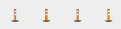
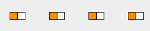
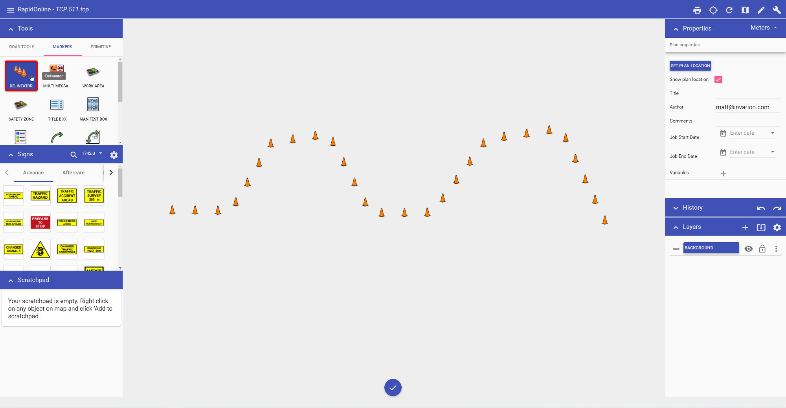

---

sidebar_position: 1

---
# Using Delineators

Traditionally, one of the most difficult things to do when creating a traffic plan was run out lines of bollards, cones, barrels, etc. The RapidPlan Online delineator tool allows you to drag out lines of devices in seconds.

**Types of Delineators available:**

There are thirteen standard types of delineators available:

|         Name         |              Delineator              |
| :------------------: | :----------------------------------: |
|        Barrel        |   |
|       Barrier        |   |
|       Bollard        |   |
|         Cone         |   |
|        Jersey        |   |
|     Para webbing     |   |
|   Pedestrian tape    |   |
|    Safety barrier    |   |
|       Tubular        |   |
|   Type 1 Barricade   |  |
|   Type 2 Barricade   |  |
| Vertical faced panel |  |
| Water filled barrier |  |

## Creating a basic Delineator line

All delineator lines start by default as Cones. They can then be changed into the required type after placement on the plan. You can also set new values for the spacing and size of the delineator from the Properties Palette.

**To create a basic delineator line:**

- Select the Delineator from the Markers tab in the Tools Palette;
- Click once where you wish to start drawing (don't hold);
- Click at each corner for your line, to drop a control point;
- After you have placed the end point, **Right click** to stop drawing;
- **Right click** to clear the cursor.

## Changing the Properties of your Delineator

Once your line is on the plan, you can change the various Properties of your delineator.

### To change delineator types

- Select the delineator line on the plan and observe the Properties Palette;
- Click on the Type drop down box and choose the type of delineator required from the Type drop down box.

### To change size and spacing

- Chance spacing by entering value in the **spacing** box;
- Change your size in the **size** box by entering a value, by default it will be set at 6;
- The drawing style of the delineator can also be changed (Point, Contiguous, Parallel).

**Note:** To change your unit of measurement, click the drop down box highlighted below.

