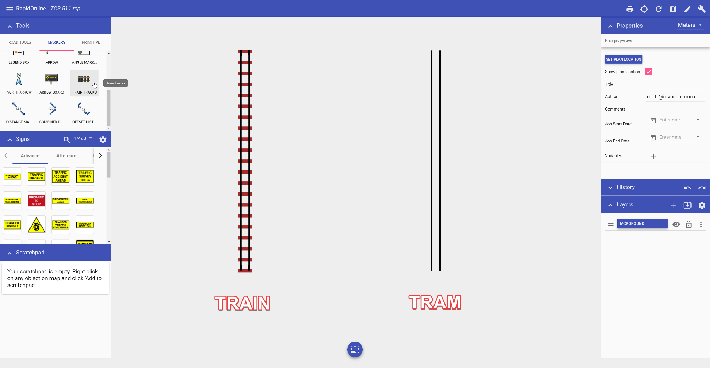

---

sidebar_position: 5
tags:
  - markers-devices
  - mapping-geospatial

---
# Train Track tool

The Train Tracks tool allows you to quickly add train or tram (light rail) lines to your plan.

**To place a train line:**

- select the **Train Tracks** tool from the Markers tab in the **Tools palette**;
- click once to start your rail line;
- click at each turn point;
- right-click to stop drawing

To place a tram line, once the tool is selected, navigate to in the **Properties palette** and change the **Type** value from **Train** to **Tram**.

Examples of train and tram tracks are show below.

