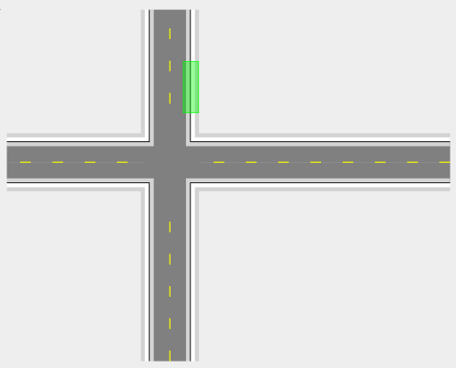

---

sidebar_position: 3

---
# Work Area and Safety Zone Tools

The Work Area and Safety Zone tools are designed to show where the site works and associated safety areas are on your plan. Their appearance can be customized, but are typically hatched (or gridded) so that they are easily recognized.

## Drawing a Work Area or Safety Zone

- Select the appropriate tool (Work zone, Safety zone) from the Markers tab in the Tools palette;
- Click at the first corner point of your required area and continue clicking to set corner points;
- When the final point is placed, right click to stop drawing;
- Right click to clear the cursor.

An example work zone is shown below.

**Note** that holding **Shift** will lock the span between two control points to 15 degree increments, allowing for perfectly horizontal, vertical or angled lines.
