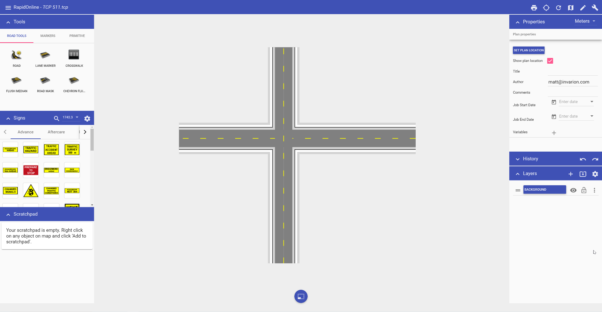
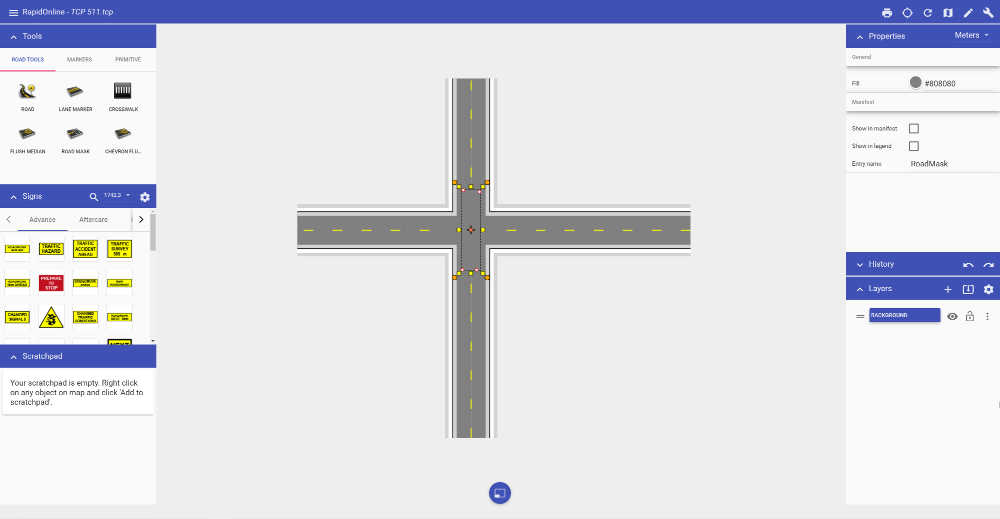
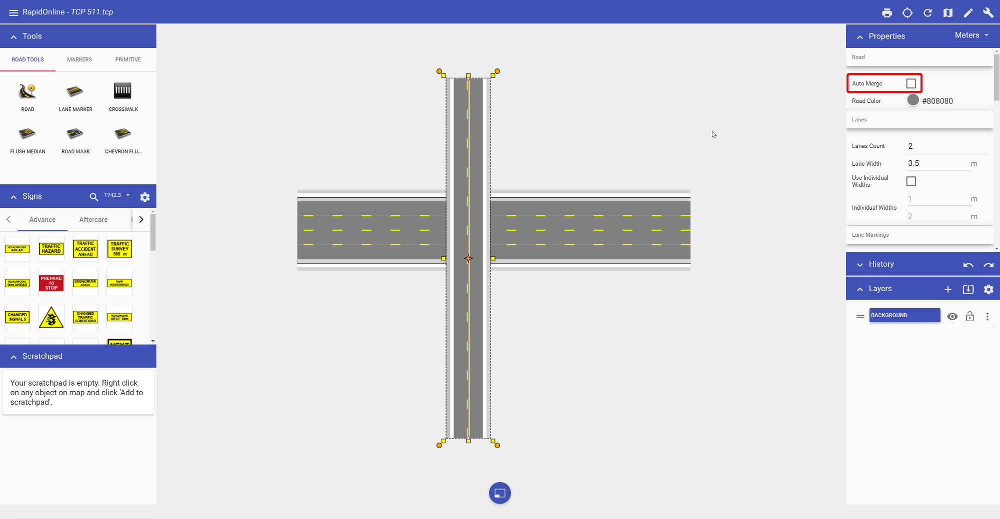

---

sidebar_position: 3
tags:
  - drawing-editing
  - road-tools

---
# Create intersections

The real power of RapidPlan Online lies in its ability to quickly create intersections. They are formed by **adding** new roads to existing ones. RapidPlan Online will automatically remove edge lines, shoulders, and sidewalks to blend at the intersecting point where a road is overlapping another road.

**To form an intersection:**

- select the **Road tool** from the **Tools palette**;

- draw your first road;

- now draw a second road overlapping the first road

**To cover up lane markings:**

- select the tool from the Road tools in the **Tools palette**;
- start using the tool as you would use the Work Zone tool drawing a perimeter of the road mask enclosing all the lane markers you want;
- right-click to finish

**To create an overpass:**

- select the road you want as the overpass;
- in the Properties of the selected road, uncheck **Auto merge**;
- style the overpass road as required

