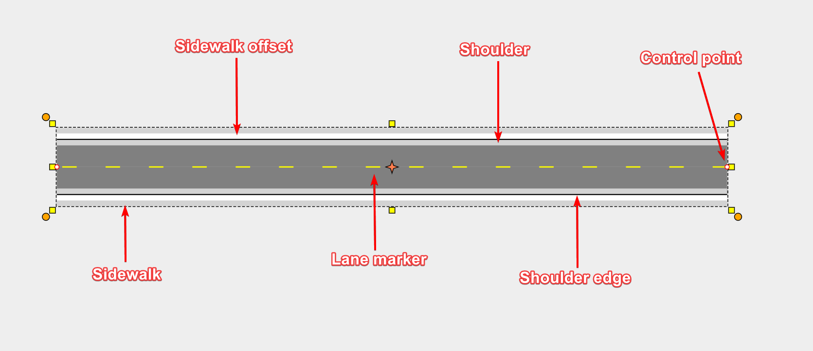

---

sidebar_position: 1

---
# The Road Tool

Using the road tool is very simple. As you move the mouse after you have clicked to start drawing, the roadway will "snake" behind the cursor. Each time you click the mouse on the canvas, a new control point for the road is placed.

## Drawing a Road

- Select the **Road** from the Tools palette.
- Move your mouse to the canvas and click once to start drawing your road.
- Move the mouse around the canvas, clicking at each control (turning) point.
- When you have placed your final point, **Right click** to stop drawing.
- If you don't want to draw another road, **Right click** again to drop the road tool.

**Tip:** A simple shortcut allows you to draw perfectly straight roads. By holding **Shift**, the tool will make sure that each control point is placed in a perfectly straight line. Move the move left or right, and the straight section of road will 'jump' in 15 degree increments.

## Components of a road

The road contains a number of elements, as shown below. Each of these can be adjusted in the Properties palette, as described in the [Editing the Road](./editing-the-road.md) section.

