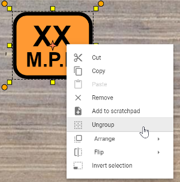
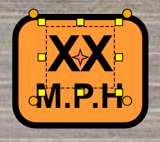
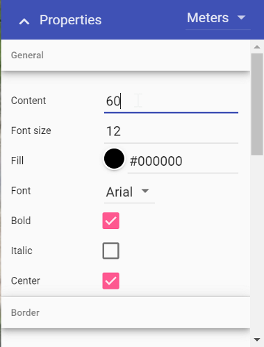
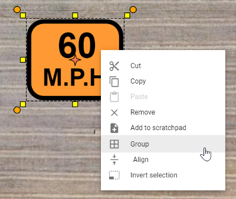
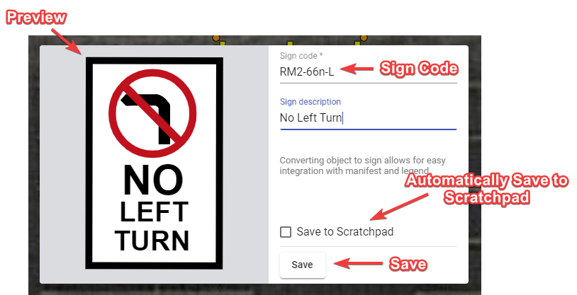

---

sidebar_position: 2
tags:
  - signs

---
# Edit and create custom signs

All signs are made up of basic objects (text, shapes, etc). Not only does this make it easy to adjust the speed on a sign, for instance, it also makes each sign object completely customizable.

To edit a sign, select it on the canvas, then select **Ungroup** in the [context menu](/rapidplan-online/rapidplan-online-basics/control-points). This separates the sign into its basic objects.

**Note:** Some signs with multiple objects may require more than one ungroup action.

Once you have ungrouped the objects, you will be able to edit, move and change the individual properties of each object within the sign.

For example, in the image above, the first text object is selected. In its properties you can then change the value to a specific amount.

To regroup the sign objects, select all objects using a selection window. Then, right-click and select **Group** in the context menu.

**Tip:** Add the new sign to your [Scratchpad](/rapidplan-online/rapidplan-online-workspace/scratchpad-palette) for later use by selecting **Add to scratchpad** in the context menu.

## Creating custom signs

You can create a **custom sign** from primitive objects, parts of other signs, or both. When you finish preparing your sign, right-click the object or objects and choose **Convert to sign** from the context menu. In the dialog, fill in the sign code and sign description fields, then select **Save**.

Your custom sign can be included in the **manifest** and **legend** because it has sign properties such as **show in manifest** and **show in legend**. The sign you created will not appear in the signs library, but you can save it to the scratchpad for later use.

