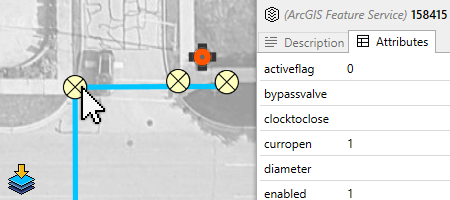
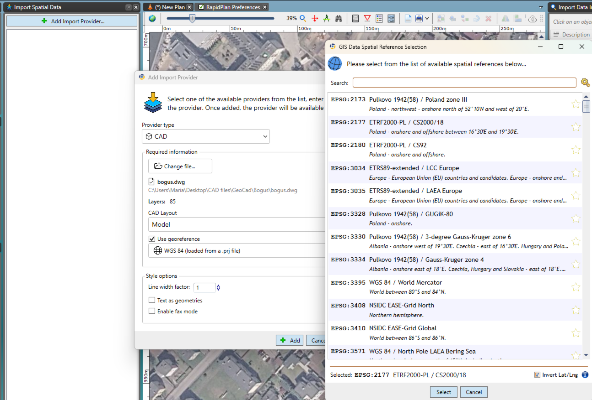
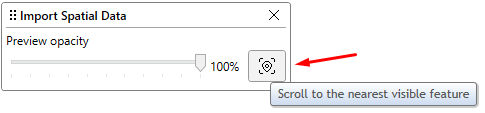

# Spatial Data Import

RapidPlan 4.4 replaced the older separate KML, Shapefile, and CAD import workflows with a unified **Spatial Data Import** tool.

Use it when you want to preview spatial data over your plan before importing it.

## Supported provider types

The current Spatial Data Import workflow supports:

- ArcGIS Feature Service layers,
- CAD files: `DWG`, `DXF`,
- KML and KMZ files,
- ESRI Shapefiles: `SHP`.

Multiple providers can be added to the same workflow, including several providers of the same type.

## Start an import

You can start the workflow in any of these ways:

- **Tools** > **Import** > **Spatial Data**,
- the **Add Import Provider** action in the import window,
- drag and drop a supported file onto RapidPlan.

## How the workflow works

1. Add one or more providers.
2. Preview their data over the current plan.
3. Turn provider visibility on or off as needed.
4. Click preview features to inspect available names, descriptions, or attributes.
5. Import the data that is currently visible and enabled.

The preview updates as you pan and zoom, so you can focus on the area you actually want to bring into the plan.

## ArcGIS imports

ArcGIS support is new in this workflow. You can:

- connect to an ArcGIS Feature Service URL,
- pick one or more layers from that service,
- preview geometry before importing,
- save useful ArcGIS sources as bookmarks for reuse.

If you need public sources to test with or explore, see [Finding ArcGIS Feature Services](./finding-arcgis-feature-services).

## CAD imports

CAD files are now handled in the same import interface as the GIS formats.

Key points:

- `DWG` and `DXF` are supported,
- layout and layer information can be reviewed before import,
- spatial reference can be supplied when needed,
- non-georeferenced CAD can still be useful on non-basemap plans.

### Import georeferenced CAD

Before importing:

- open or create a RapidPlan plan with a location and basemap,
- confirm the coordinate system used by the source file. You may need its EPSG code,
- keep any accompanying `.prj` file in the same folder as the `.dwg` or `.dxf` file.

1. Open **Tools** > **Import** > **Spatial Data**.
2. Select **Add Import Provider**.
3. Set **Provider type** to **CAD**, then open the `.dwg` or `.dxf` file.
4. Review the file path and detected layer count.
5. Set **CAD Layout** to **Model**.
6. Select **Use georeference**.
7. Select the displayed spatial reference to open **GIS Data Spatial Reference Selection**.
8. Search for the required spatial reference by EPSG code and select it.
9. Select or clear **Invert Lat/Long** as required by the coordinate system, then select **Select**.
10. Select **Add**.

The CAD preview should appear at its mapped location. If it is outside the current view, select **Scroll to the nearest visible feature** in the **Import Spatial Data** window.

Select the features you need, then select **Import Selected Data**. Finish the import when the required geometry is on the plan.

For export settings and procedures, see [Export georeferenced CAD](/rapidplan/printing-and-export/print-and-export-operations/cad-export#export-georeferenced-cad).

## KML and Shapefile imports

KML, KMZ, and Shapefile data are still supported, but they now use the same Spatial Data Import workflow instead of the legacy KML/Shapefile palette.

This makes it easier to:

- combine several datasets in one session,
- preview what will be imported,
- inspect attributes before import,
- work consistently across GIS and CAD sources.

## What gets imported

Depending on the source data, RapidPlan can import:

- point data,
- lines and paths,
- polygons,
- styling where supported,
- feature attributes for supported sources.

Imported geometry can then be snapped to, edited, and used as the basis for further drawing.

## Related tasks

- use [Road import](./road-import) for OpenStreetMap road layouts,
- use [Georeferenced image import](./georeferenced-image-import) for map images rather than vector data,
- use [Integrated map providers](../integrated-maps/integrated-map-providers) if you first need to create or configure a base map plan.
