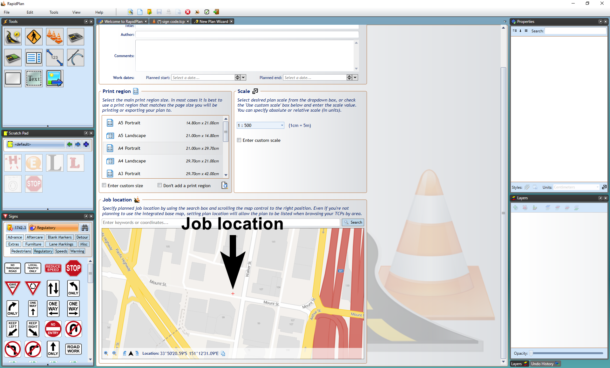
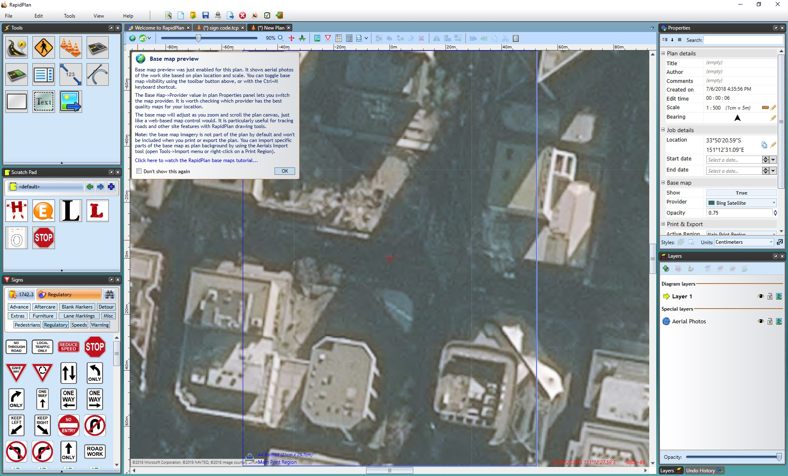
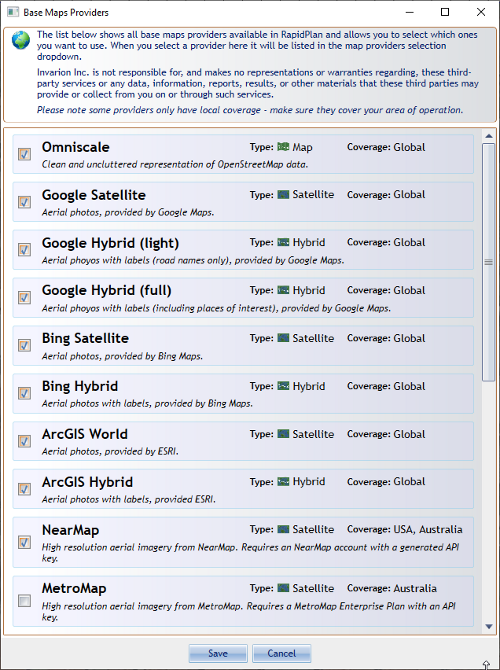
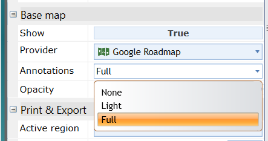
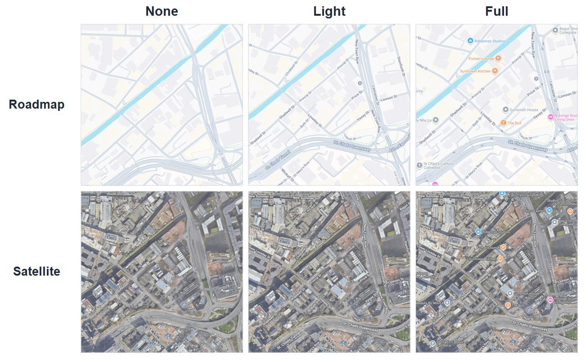

# Integrated map providers

RapidPlan's mapping tools start with a **Base Map** plan. Once a plan has a location and scale, you can use live basemaps, import aerial photos, bring in road or GIS data, and use location-aware tools.

## Create a base map plan

1. Open the [New Plan Wizard](/rapidplan/home-screen-and-starting-a-plan/new-plan-wizard).
2. Choose **Base Map** in step 1.
3. Set a plan scale, then search for the job location by address, coordinates, or other supported location formats.
4. Adjust the map so the red cross marks the location you want to start from.
5. Select **Create Plan**.

## Choose a provider

Use the **Base map** section in the **Properties palette** to:

- show or hide the basemap
- change the provider
- adjust the map opacity
- open the provider list and enable additional providers

RapidPlan includes global providers such as Google, Bing, and ArcGIS, plus regional and subscription-based providers that depend on your country version and connected services.

## Google basemaps

Google is one of the main basemap options for current RapidPlan workflows:

- **Google Roadmap** is useful when you want road layout and labels.
- **Google Satellite** is useful when you need aerial context.
- Google annotations can be reduced or removed to keep the basemap clean while drawing.

In supported locations, the Google Roadmap provider can also show **Road Level Details**, including features such as **lane markings**, turn lanes, crossings, and curb detail when you zoom in far enough.

### Google annotation levels

When you select **Google Roadmap** or **Google Satellite**, the **Base map** section includes an **Annotations** dropdown.

Use this setting to control how much Google map labeling appears on the basemap:

- **None** shows a clean map without road labels, points of interest, or place names.
- **Light** adds road labels and transport stops. With **Google Satellite**, this gives a satellite view with road labels, similar to the older Google Hybrid view.
- **Full** shows the full Google map labeling, including road labels, points of interest, and place names.

## Additional providers

Depending on your region and subscriptions, you may also have access to providers such as:

- NearMap
- MetroMap
- government or regional imagery services
- ArcGIS-based imagery services

If a provider is not visible in the main dropdown, open **More providers...** and enable it there first.

## Custom service provider

RapidPlan also supports a **Custom Service** basemap provider for compatible tiled services.

Use it when you need to connect RapidPlan to:

- a WMTS service
- an ArcGIS MapServer tile service

To add one:

1. Open the **Provider** dropdown in the **Base map** section.
2. Select **More providers...** and enable **Custom Service**.
3. Pick **Custom Service** from the provider list.
4. Enter the service URL and, if required, an API key.
5. Select **Get Details** and choose one of the detected compatible configurations.

Compatible custom basemap services need to use Web Mercator with a Google-compatible tiling scheme.

## Using the map as a drawing reference

The live basemap preview is useful as a stencil while drawing. You can lower map opacity, trace roads or work areas over the background, and then turn the preview off when you want to check only the plan objects.

If you need the imagery to print or export, import aerial photos instead of relying on the live preview.

## Related tasks

- Use [Spatial Data Import](../importing-external-data/spatial-data-import) to bring in ArcGIS, CAD, KML, and Shapefile data.
- Use [Road import](../importing-external-data/road-import) when you specifically want road geometry from OpenStreetMap data.
- Use [Aerial photo import](./aerial-photo-import) when you need basemap imagery included in print or export output.
- Use [Georeferenced image import](../importing-external-data/georeferenced-image-import) for already georeferenced map images.
- Use [Printing and export](/category/printing-and-export) when you need output files.
