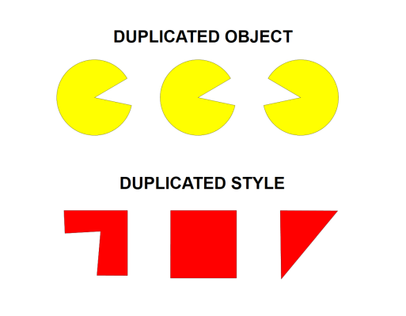

---

sidebar_position: 11
tags:
  - drawing-editing
  - object-properties

---
# Duplicating objects and styles

RapidPlan has made it simple to duplicate objects and/or an items property  onto another item.

## Duplicate an object

- right-click on the desired object to duplicate
- hover cursor over **Duplicate** in the contents menu
- select **Object**
- click to place as many duplicated objects as needed
- or *Keyboard shortcut:* **Ctrl + D**

## Duplicate an object style

- right-click on the desired object to duplicate it's style
- hover cursor over **Duplicate** in the contents menu
- select **Style**
- draw object with the duplicated style
- or *Keyboard shortcut:* **Ctrl + Shift + D**

## Duplicate styles onto other items

As shown in the image below, you can paste the style/properties of one item onto other items. This can be useful when, for example, you have different **road tools** in use (eg. road, roundabout, arc road) and you want to give them all the same style/properties.

**To duplicate a style onto a different item:**

- select the item to duplicate style
- press **Ctrl + C**
- now select item to transfer the style onto it
- press **Ctrl + Shift + V**
