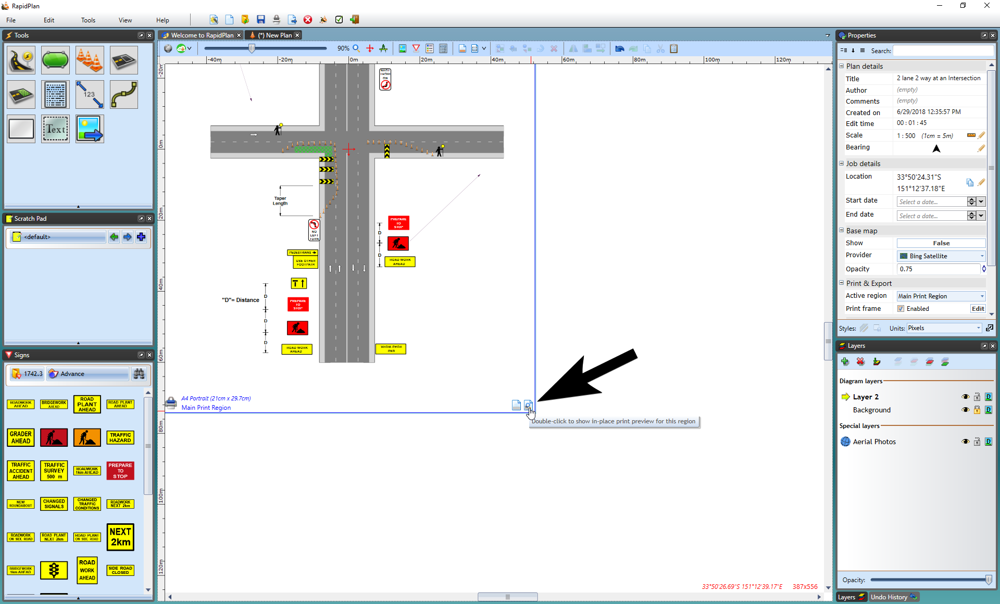
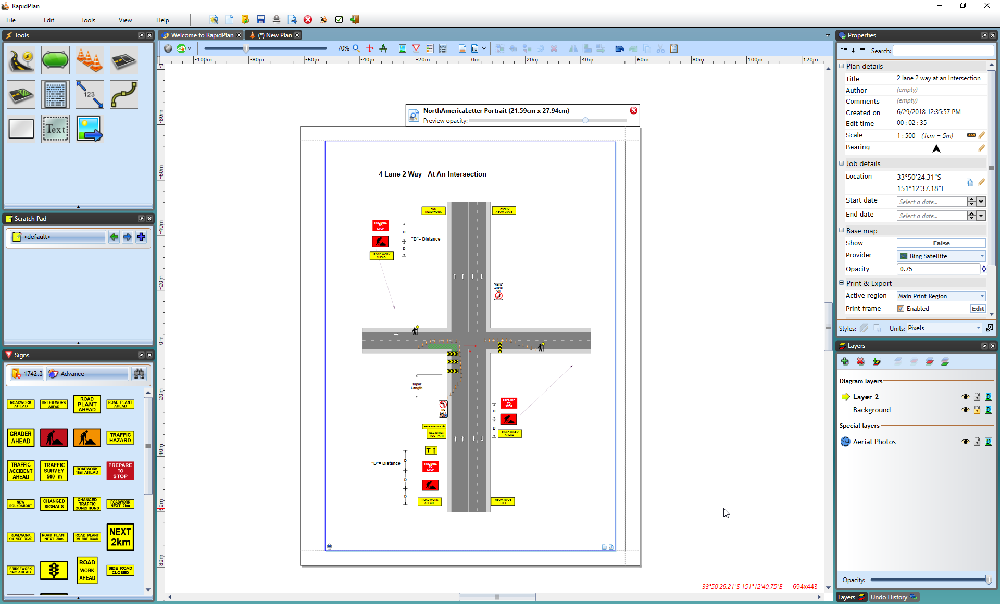

---

sidebar_position: 2

---
# In-place Print Preview

**File** > **Print** > **Print Preview** is one way of checking how your frame fits together with your plan content on the printout page, but RapidPath is also able to overlay the print preview directly over the plan you're editing. To enable the in-place print preview, **Double click** the icon located in the bottom right corner of the print region or **Right click** on the print region icon and select **In-place print preview**.

The in-place preview is a great choice if you need to adjust the positioning of your TCP elements so they aren't obscured by the frame. In fact, you can even move or resize the whole print region and the preview will automatically adjust as required, allowing you to to quickly select areas you want to print (note that while the print region decoration displays smaller icons in preview mode, to prevent cluttering, it is still active and you can use its resize handles).
On plans with multiple print regions, only one preview can be active at the same time, but you can easily toggle between regions by **Double clicking** on their in-place preview icons. To close the preview, use red **X** icon or the **Escape** key.

**Note:** even if your plan or print region doesn't have a print frame, you can still use the in-place print preview to see how your print region will be laid out on the printout page.
