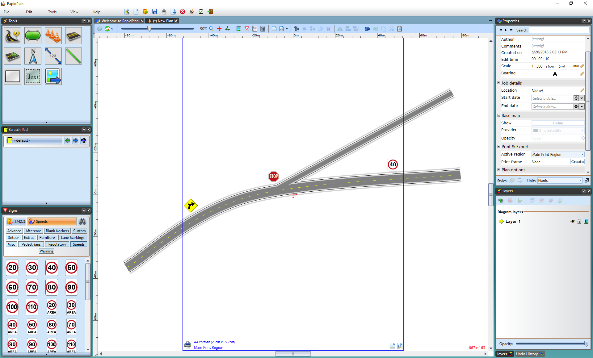
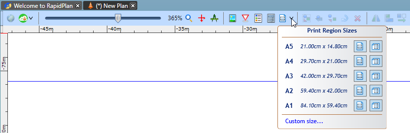
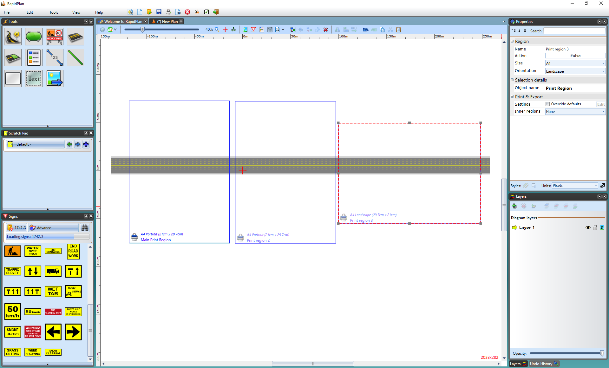
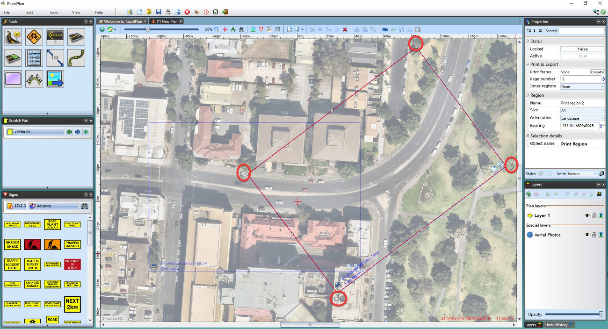

# Print regions

Print regions define what part of a plan will be printed or exported on each page.

They are one of the core output tools in **RapidPlan**, especially when:

- a single plan needs several pages
- different parts of a large site need separate sheets
- the same plan needs alternative output areas or page orientations

## Add a print region

Use the print region tool on the toolbar to:

- draw a custom region by dragging on the plan
- choose from preset region sizes from the tool's dropdown

Everything inside the region is included in print or export output. Content outside the region stays on the plan, but it is not included on that page.

## Work with multiple regions

You can add multiple **print regions** to the same plan.

This is useful for:

- long roads or corridors
- large sites with several work areas
- one plan that needs different sheets for different audiences

Each region can be activated, resized, moved, rotated, styled, printed, or exported independently.

## Ordering and batch output

Recent **RapidPlan** versions use a single consistent ordering system for **print regions**.

The order shown in the **Print Regions** window is the default order used by batch output workflows. If page order matters, arrange the regions there before printing or exporting.

This is generally better than relying on manual names or page numbers.

## Region comments and labels

Print regions can also carry comments and naming information that help with:

- organizing output
- communicating page-specific notes
- filling text variables in print or export layouts

## Rotate print regions

Each print region can have its own bearing. This is useful on curved or angled sites where a rotated page fits the content better than a north-up sheet.

You can rotate a region by:

- selecting the region and dragging its **rotation handles**
- entering an exact bearing in the **Properties palette**

## Related tools

- Use [Print frames](./print-frames.md) for titleboxes and reusable page layout.
- Use [In-place print preview](./in-place-print-preview.md) to check how plan content sits on the page.
- Use [Printing plans](../print-and-export-operations/printing-plans.md) for single-plan and **batch print** workflows.

