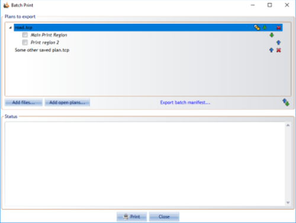
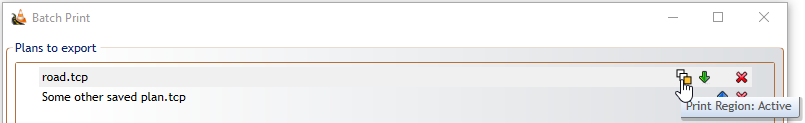
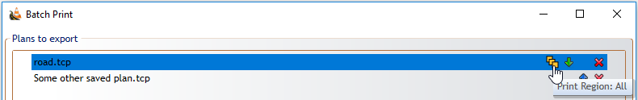
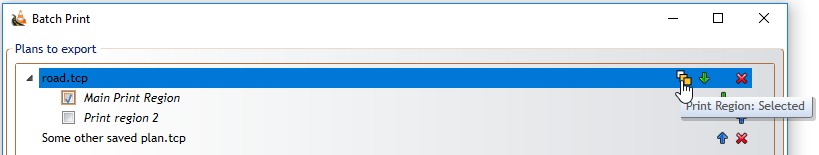

---
sidebar_position: 2
---

# Batch print and export

Use batch output when you need to print or export several print regions, plans, or stages in one operation.

## Batch printing

Open **File** > **Print** > **Batch Print** to add files or open plans, choose regions, and print them in the required order.

For each added plan, RapidPlan lets you choose whether to print:

- the active region only
- all regions on the plan
- selected regions only

## Batch export

Use batch export when you need files rather than printer output.

Batch export supports workflows such as:

- exporting multiple regions
- exporting multiple plans
- exporting a separate PDF for each stage
- using common page numbering or separate numbering per output file
- saving reusable export configurations

## Region order

The order in the Print Regions window defines the default region order for batch output. Arrange print regions there before running batch print or export when page order matters.

