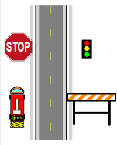
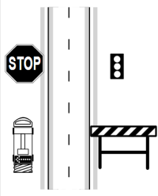
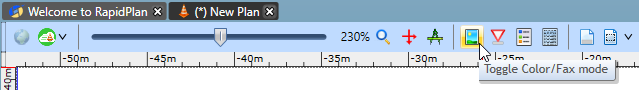

# Fax mode

Fax mode converts plan content into a higher-contrast black-and-white version that is easier to read in low-quality print, scan, or fax output.

| Color mode | Fax mode |
| :--------: | :------: |
|  |  |

Toggle it with the color/**fax mode** button on the toolbar.

Fax mode uses each object's fax-friendly appearance where available, so roads, signs, markings, and other plan objects remain legible without relying on color.

