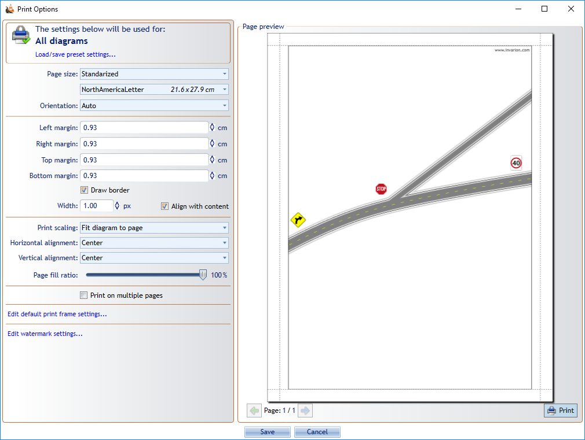

# Printing plans

Use printing when you need a paper copy or a printer-driven output of the active plan or active print region.

For most output workflows, start by setting up:

- one or more [print regions](../output-setup/print-regions.md)
- an optional [print frame](../output-setup/print-frames.md) for titleboxes, legends, notes, and reusable page layout

## Print options

Open **File** > **Print** > **Print Options** to control:

- paper size
- orientation
- margins
- scaling
- multipage printing
- other output defaults used by print and export workflows

## Printing a single plan

Use the regular print workflow when you want to print the active plan or its active region.

This is the best option when you are:

- checking page layout
- printing one region at a time
- working interactively on the current plan

For multiple plans or **print regions**, use [Batch print and export](./batch-print-and-export.md).

## Related output workflows

- Use [In-place print preview](../output-setup/in-place-print-preview.md) to check page layout directly on the plan.
- Use [Export formats](./export-formats.md) when you need PDF, image, or CAD output.
- Use [Fax mode](./fax-mode.md) when output must remain readable in black and white.

