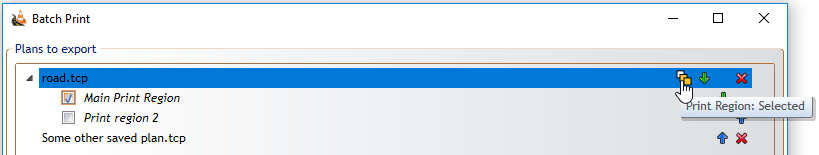

---

sidebar_position: 10

---
# Printing  Plans

## Arrangements Prior to Printing

Before printing, a [Print Region/s](/docs/rapidplan/the-canvas-area/print-regions.md) will need to be in place.

You will likely want to include annotations (titleboxes, legends etc.) in your exports. It is often beneficial to organise these within a [Print Frame](/docs/rapidplan/the-canvas-area/print-frames.md), which can be reused in perpetuity for printing.

## Printing Plans

The importance of the page guide is at it's greatest when printing, because on unrestricted canvas plans there are different printing options available to you.

You can access the Print Options by clicking on **File** > **Print** > **Print Options**. The Print Options box will open similar to the one below.

As you can see there are many options to choose from. Irrespective of what you have on the canvas, everything you have drawn can be stretched or shrunk to fit on the paper size you choose. There are many available page sizes to choose from as well as the option for creating a custom size. There is also the option for printing on multiple pages.

If you have more than one print region, or you want to print regions from other plans, you use the **Batch printing** option.

You can access Batch Printing by clicking on **File** > **Print** > **Batch Print**. There you can add files or add open files, select which regions you want to print (some or all of them), sort in which order to print (manual sort, sort by alphabetically, creation date  or by last edit).

If there is more than one print region on added plan, there will be **Three Rectangles** icon on top right corner. Orange filling of every rectangle represents different option:

- Print just active region

    

- Print all regions on plan
  
    

- Print just selected region(s)

    

## Fax Mode

Have you ever tried to fax something that's in color, and found that it's barely readable at the other end? The reason for this is because of low contrast between items in the initial document. Fax machines are great at black and white documents, or low color documents created with fax machines in mind.
But for high color documents they can be downright troublesome - that's why RapidPlan has a very clever Fax mode which converts everything to pure black and white. Every RapidPlan element has a Fax Mode form.

## Applying Fax Mode

In order to make faxing easy, each element in RapidPlan has a fax friendly form. This applies to roads, signs, everything. A few examples are below:

|Color mode                         |Fax mode                               |
|:---------------------------------:|:-------------------------------------:|
| |  |

Switching Fax mode on and off is simple. Just click on the Toggle Color/Fax mode button from the Options toolbar. Your entire plan is updated with a single button click.

## Making Your Own Signs in Fax Mode

You can create and edit fax mode versions of your own signs and objects. This can be done by selecting **View** > **Sign Editor**.

*See [Creating Your Own Signs](/docs/rapidplan/creating-your-own-signs/creating-your-own-signs.md) for more information on Making Your own Signs.*
