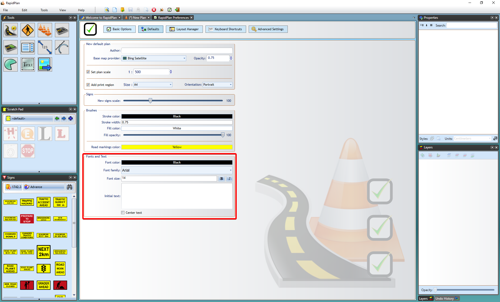
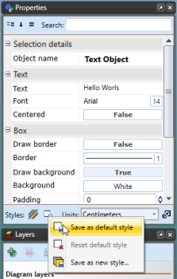

# Plan and object defaults

The **Defaults** section in Preferences controls the values RapidPlan uses when it creates new plans, objects, signs, brushes, fonts, and text objects.

Open it from **Tools** > **Preferences** > **Defaults**.

## New default plan

Use the new-plan defaults to set values RapidPlan should apply when a new default plan is created.

Common defaults include:

- author
- base map provider
- aerial import provider
- plan setup values used by default-plan workflows

The aerial import provider can be different from the visible basemap provider. This is useful when you draw over a free cartographic map but want imported aerial tiles to come from a paid imagery provider such as NearMap or MetroMap.

## Signs

Use the sign defaults to set the default scale for new signs.

## Brushes

Use brush defaults to control default line and shape styling.

## Fonts and text

By default, RapidPlan creates text with its default font settings. To change the default text style:

1. Open **Tools** > **Preferences**.
2. Select **Defaults**.
3. Scroll to **Fonts and Text**.
4. Set the font and text properties you want new text objects to use.
5. Close the Preferences tab.

You can also create a text object, style it in the **Properties palette**, then use **Save as Default Style** to reuse that style for new text objects.

