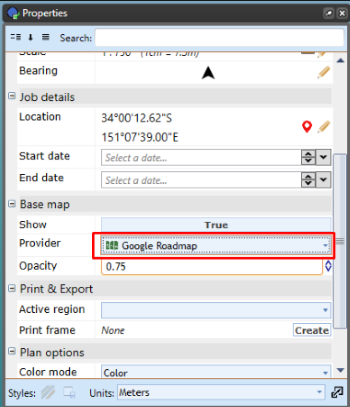
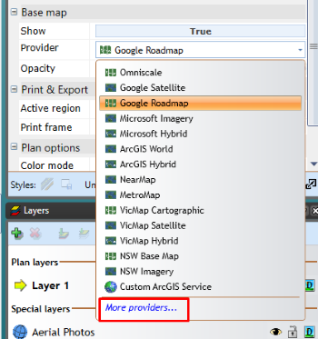
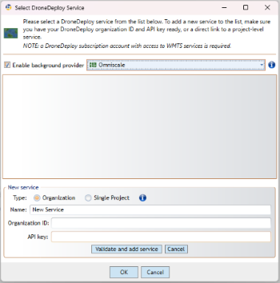
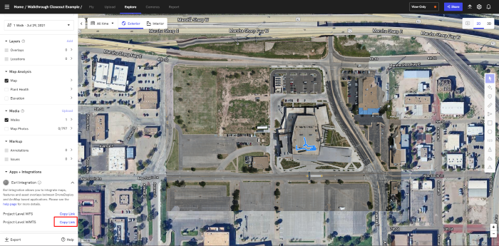
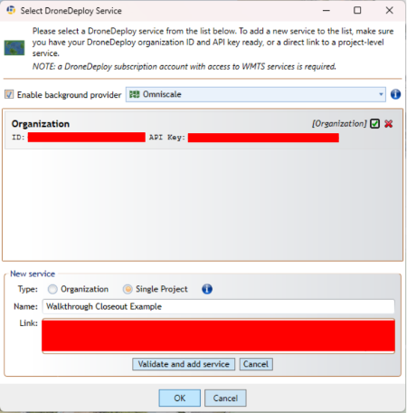
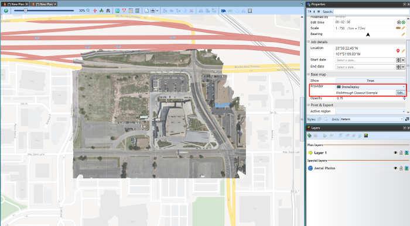

---

sidebar_position: 9

---
# DroneDeploy Aerial Imagery

DroneDeploy is a powerful platform for colating and arranging drone-recorded imagery. With the steps below, DroneDeploy projects can now be ported to RapidPlan directly.

## Adding DroneDeploy as a basemap provider

To start using DroneDeploy as a basemap provider in RapidPlan, please ensure you have a current DroneDeploy subscription. An account can be created at [https://dronedeploy.com/](https://dronedeploy.com/).

There are two ways to integrate DroneDeploy with RapidPlan: Organization and Single project, each option will be discussed below.

Follow these steps to integrate RapidPlan with DroneDeploy:

1. Create a RapidPlan plan that includes a *Base map*;
2. Navigate to the *Base map* section of the Properties palette;

3. Click More providers, at the bottom of the Provider dropdown list;

4. Check DroneDeploy in the Base Maps Providers list and click Save;

5. Select DroneDeploy from the Provider dropdown list. A Select DroneDeploy Service window will appear.

Note: Enable background provider will show content from a selected base map provider outside the area provided by your DroneDeploy service. If you would like to the provider used as the background, close this window and choose the provider;

6. To connect to the DroneDeploy service, click Add a new service.

At this point you will proceed with either **Organization Service** integration or **Single Project**:

### Organization Service

As pictured below:

- Select the **Organization** option;

- Enter data your DroneDeploy credentials (OrganizationID, API key);

- Click **Validate and add service**;

- Click **OK**.

The new service will then be added to the window.

Click **OK**, then navigate to the location where you have created your project using the DroneDeploy service. Your imagery will be displayed on the Aerial Photos layer.

### Single Project Service

To add Single project service, click Edit in the Properties palette > Base map > DroneDeploy Provider.

- Click **Add new service**;
- Select **Single Project**;
- Add the project name;
- Go to the DroneDeploy webpage;
- Open the created single project and copy the *WMTS* link:

- Then return to RapidPlan and paste the link as a Single Project:

- Click **Validate and add service**, and the single project will be added;
- Select the project from the list of services and click **OK**.

Then navigate to where the DroneDeploy imagery is located if not already centered on it.

Imported DroneDeploy imagery will be placed in the Aerial Photos layer.

