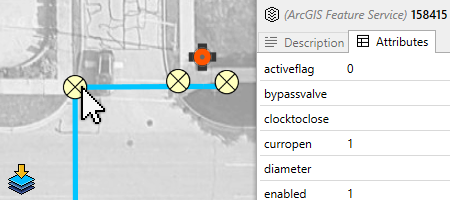

# Spatial data import

**RapidPlan** 4.4 replaced the older separate KML, Shapefile, and CAD import workflows with a unified **Spatial Data Import** tool.

Use it when you want to preview spatial data over your plan before importing it.

## Supported provider types

The current Spatial Data Import workflow supports:

- ArcGIS Feature Service layers
- CAD files: `DWG`, `DXF`
- KML and KMZ files
- ESRI Shapefiles: `SHP`

Multiple providers can be added to the same workflow, including several providers of the same type.

## Start an import

You can start the workflow in any of these ways:

- **Tools** > **Import** > **Spatial Data**
- the **Add Import Provider** action in the import window
- drag and drop a supported file onto **RapidPlan**

## How the workflow works

1. Add one or more providers.
2. Preview their data over the current plan.
3. Turn provider visibility on or off as needed.
4. Click preview features to inspect available names, descriptions, or attributes.
5. Import the data that is currently visible and enabled.

The preview updates as you pan and zoom, so you can focus on the area you actually want to bring into the plan.

## ArcGIS imports

ArcGIS support is new in this workflow. You can:

- connect to an ArcGIS Feature Service URL
- pick one or more layers from that service
- preview geometry before importing
- save useful ArcGIS sources as bookmarks for reuse

If you need public sources to test with or explore, see [Finding ArcGIS Feature Services](./finding-arcgis-feature-services.md).

## CAD imports

CAD files are now handled in the same import interface as the GIS formats.

Key points:

- `DWG` and `DXF` are supported
- layout and layer information can be reviewed before import
- spatial reference can be supplied when needed
- non-georeferenced CAD can still be useful on non-basemap plans

If your goal is output rather than input, see [CAD export](/docs/rapidplan/exporting-plans/print-and-export-operations/cad-export.md).

## KML and Shapefile imports

KML, KMZ, and Shapefile data are still supported, but they now use the same Spatial Data Import workflow instead of the legacy KML/Shapefile palette.

This makes it easier to:

- combine several datasets in one session
- preview what will be imported
- inspect attributes before import
- work consistently across GIS and CAD sources

## What gets imported

Depending on the source data, **RapidPlan** can import:

- point data
- lines and paths
- polygons
- styling where supported
- feature attributes for supported sources

Imported geometry can then be snapped to, edited, and used as the basis for further drawing.

## Related tasks

- Use [Road import](./road-import.md) for OpenStreetMap road layouts.
- Use [Georeferenced image import](./georeferenced-image-import.md) for map images rather than vector data.
- Use [Integrated map providers](../providers/integrated-map-providers.md) if you first need to create or configure a base map plan.
