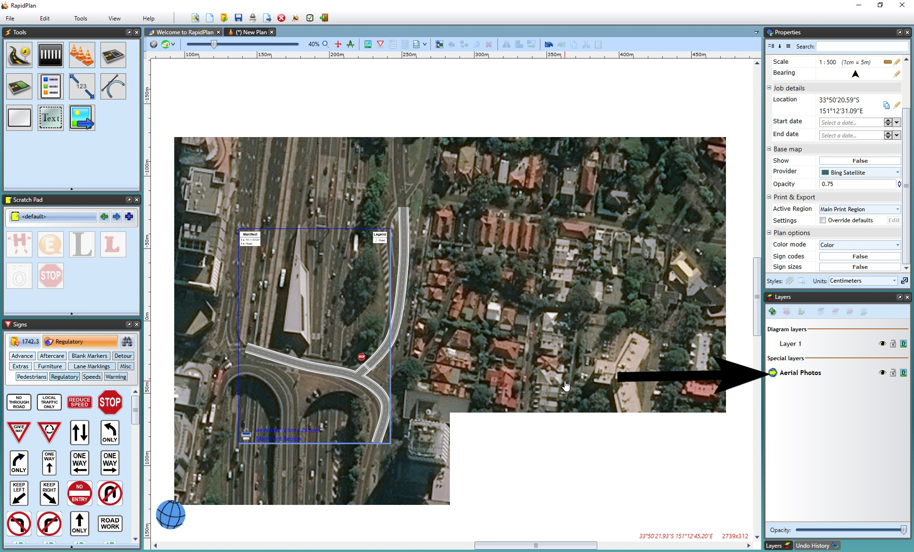
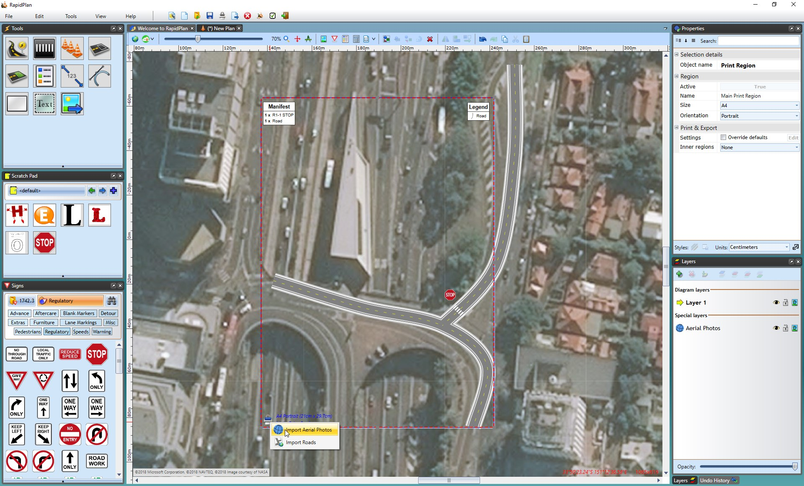
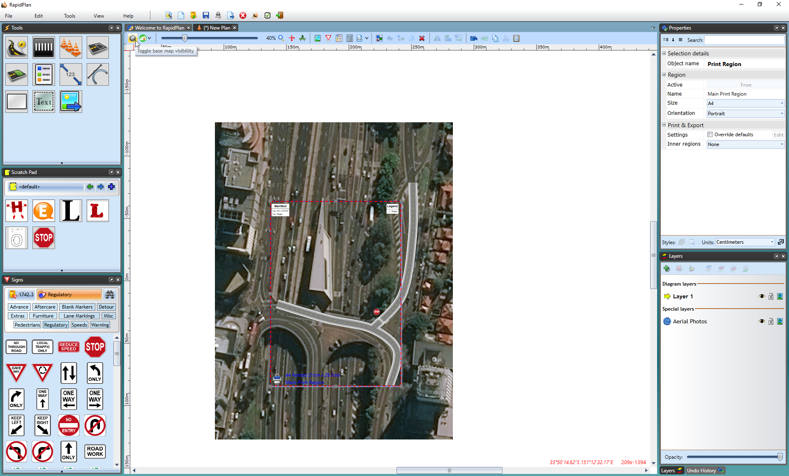
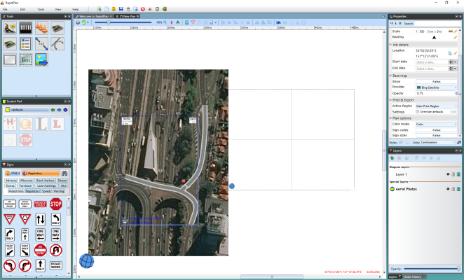
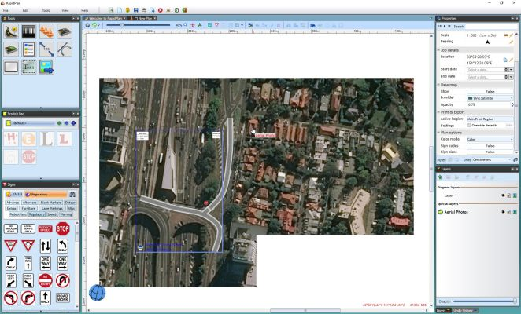
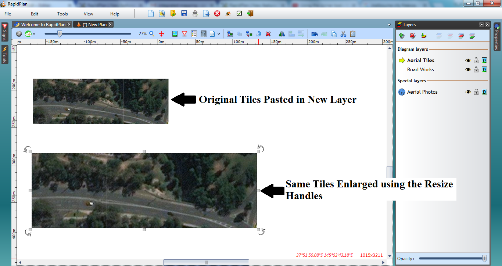

# Aerial photo import

The live basemap preview is not part of the plan drawing itself. If you need map imagery to appear in printed or exported output, import aerial photos as plan objects.

Imported aerial photos are placed on an **Aerial Photos** layer so they stay behind the rest of the plan.

## Import aerial photos for a print region

1. Right-click the print region icon.
2. Select **Import Aerial Photos**.
3. Turn off the live base map preview if you want to check the printable imagery without the preview underneath.

You can also right-click a mapped area and select **Import Aerial Photo** to import an individual tile.

## Import aerial photos for a custom area

1. Select **Tools** > **Import** > **Aerial Photos**.
2. Drag over the area you want to import.

## Working with imported tiles

RapidPlan keeps aerial photo tiles on the Aerial Photos layer so it can preserve their mapped location.

If you need to transform a tile like a normal image, copy it to another layer first:

1. Select the aerial photo tile.
2. Copy it.
3. Select the target layer.
4. Paste the tile there.

The pasted copy behaves like a regular editable image object.
