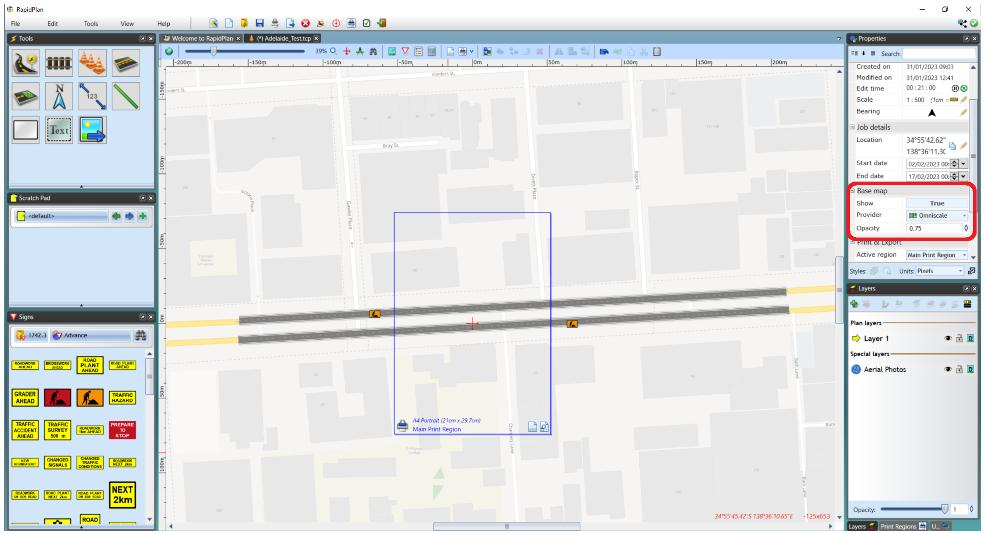
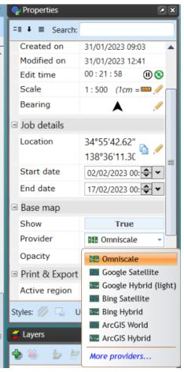
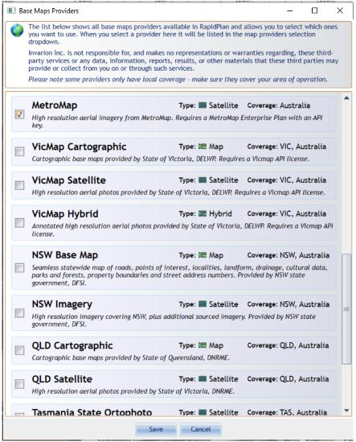
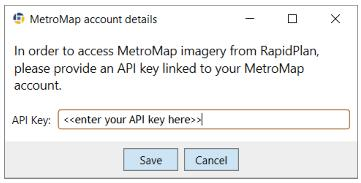
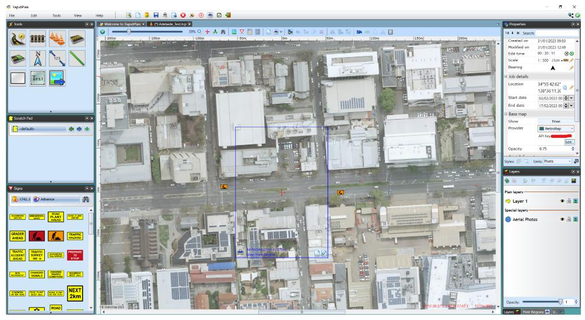
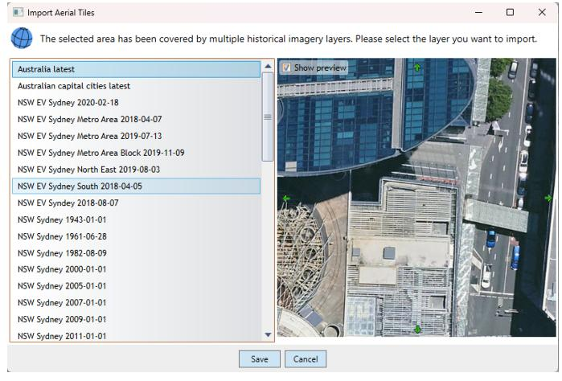
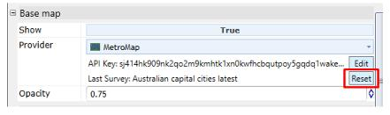

---

sidebar_position: 9
tags:
  - mapping-geospatial

---
# MetroMap aerial imagery

MetroMap is one of the available basemap providers in RapidPlan. It provides high-quality aerial photos and coverage of metro and regional areas across Australia.

To access MetroMap content directly from RapidPlan, you need an API key linked to your MetroMap account.

## Setup Steps

Make sure you are running the latest version of RapidPlan, then follow these steps to enable the MetroMap provider:

1. Create or open a plan, then open the **Provider** dropdown under **Base map** in the **Properties** palette.

2. In the **Provider** dropdown, select **More providers...**.

3. Find **MetroMap** in the list of imagery providers, select the checkbox, then click **Save**.

4. RapidPlan will ask for authentication information. Enter your API key in the **API key** field, then click **Save**.

5. MetroMap is now configured and selected as the basemap provider for the current plan. Your API key will be saved, so you do not need to re-enter it when using MetroMap for other plans.

**Please note**: If you have followed the steps above and the background shows "Connection error" or "Out of range", make sure that:

- You are running the latest version of RapidPlan.
- You copied the API key correctly.
- Your plan points to a location covered by MetroMap.

For ongoing connection issues, contact support@metromap.com.au.

## Usage

### Base Map Layer

To use MetroMap as the basemap provider for your RapidPlan plan, select it in **Properties** > **Base map** > **Provider**.

The basemap defaults to the **Australia latest** MetroMap layer.

### Importing Tiles

By default, the **Import Aerial Photos** tool uses the same provider selected in **Properties** > **Base map** > **Provider**.

This tool imports tiles as background images on your plan, so they are included when you export the plan.

When importing tiles, you can select which MetroMap layer should be used. A dialog with the layers available for your **plan location** will appear. Scroll through the list of historical imagery, check the preview tiles to find your preferred view, then click **Save** to confirm.

MetroMap layer selection is only required the first time you import tiles to your plan. Subsequent import operations on the same plan use the previously selected layer.

To select a different layer for the next import, go to **Properties** > **Base map** > **Provider** and click **Reset** last survey.

### Default Map Provider and Additional Settings

To use MetroMap as the default map provider for all new RapidPlan plans, go to **Tools** > **Preferences** > **Defaults** > **Base map provider** and select **MetroMap** from the dropdown.

If you only want to use MetroMap for importing tiles and not for the dynamic basemap layer, uncheck **Aerials import provider** > **Use current base map provider**, then select **MetroMap** from the additional dropdown below.

If you do not want to select MetroMap layers when importing tiles and want to default to **Australia latest**, go to **Tools** > **Preferences** > **Advanced Settings** > **Importing** and disable **Select aerial surveys (if supported)**.

