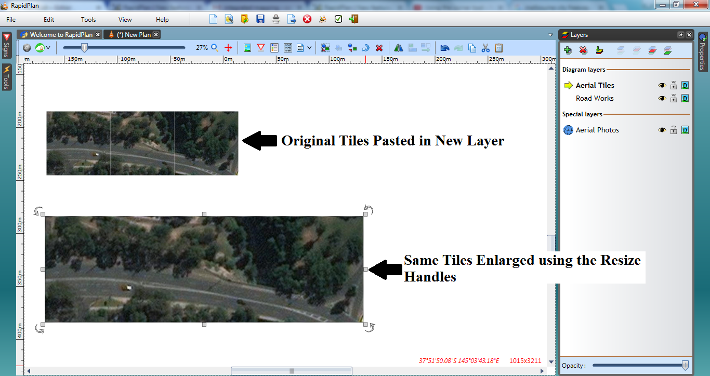

---

sidebar_position: 4

---
# The Aerial Photos Layer

RapidPlan automatically places any imported aerial photos to an **Aerial Photos** layer. This ensures that the aerial photos remain the bottom layer of your plan, as the **background**.

## Moving a Section Of the Map to Another Layer

When on the **Aerial Photos** layer, you can import tiles of the photo for extra coverage.

**To import a tile sized area of the aerial photo**, just **Double click** on the area of the plan.

However, you cannot move or transform these tiles on this layer as the layer needs to keep track of the map region. To manipulate a tile, for example to create a separate section of the plan with a different scale, you need to copy and paste the tiles onto a different layer.

**To select and move tiles to a different layer:**

- Select the tiles you want to move by clicking once on the tile, (hold **Shift** and continue to click other tiles if you want to move multiple at a time).
- **Right click**, select **copy**.
- Select the layer you wish to move them to.
- **Right click** in new layer and select **paste**.

    

    **Note:** The tiles will now be fully editable images, like any other object in RapidPlan.
