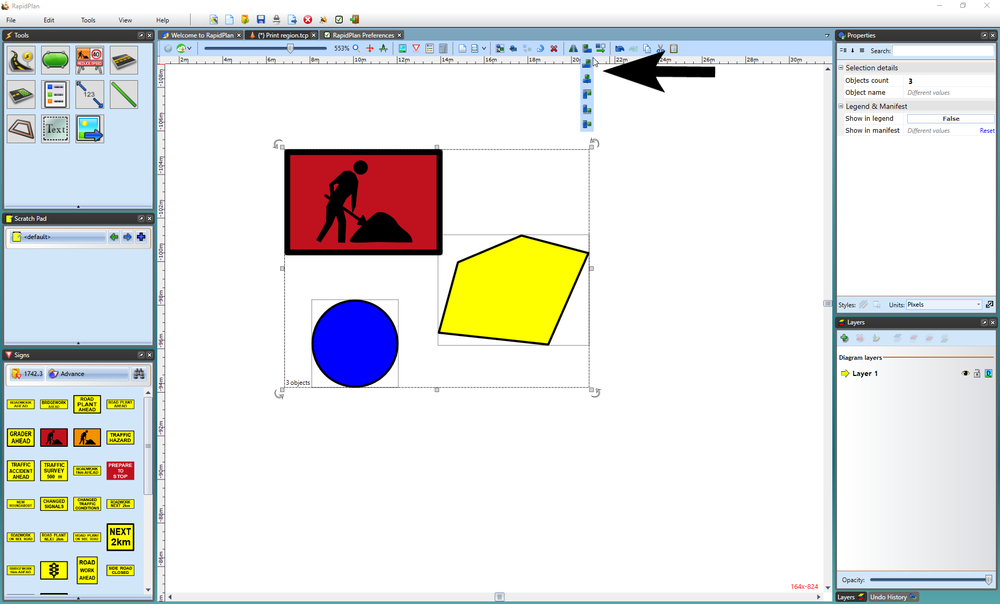

---

sidebar_position: 5

---
# Aligning and Spacing Objects

## Alignment

This function in the [Toolbar](/docs/rapidplan/the-toolbar/the-toolbar.md) allows you to align boundaries of selected objects, signs, roads, etc. 

Note it only becomes clickable when more than one object is selected.

## Spacing Toolbar

The Distribute button (spacing) in the [Toolbar](/docs/rapidplan/the-toolbar/the-toolbar.md) allows you to distribute any selected objects horizontally or vertically, with equal distances between each object.

Likewise, note this toolbar only becomes visible when multiple objects (three and more) are selected.

