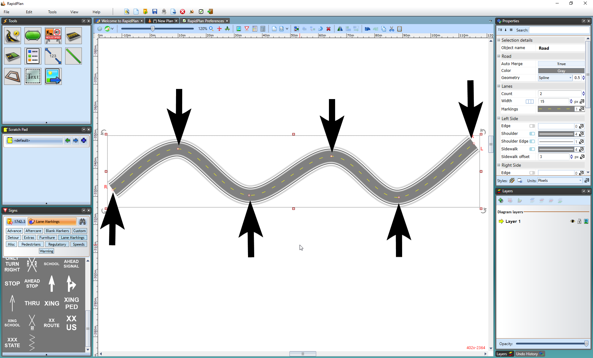
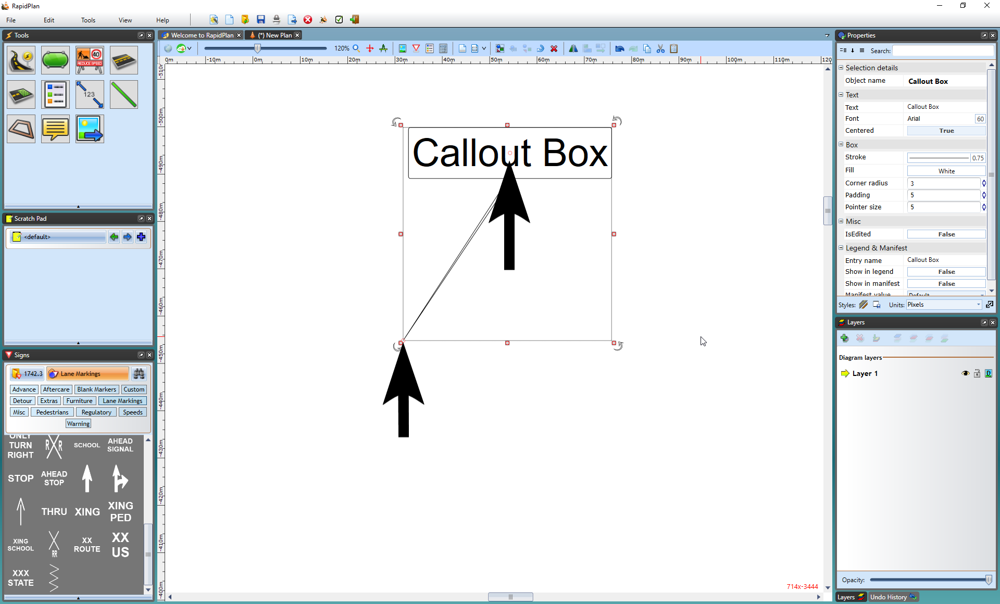
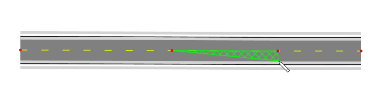
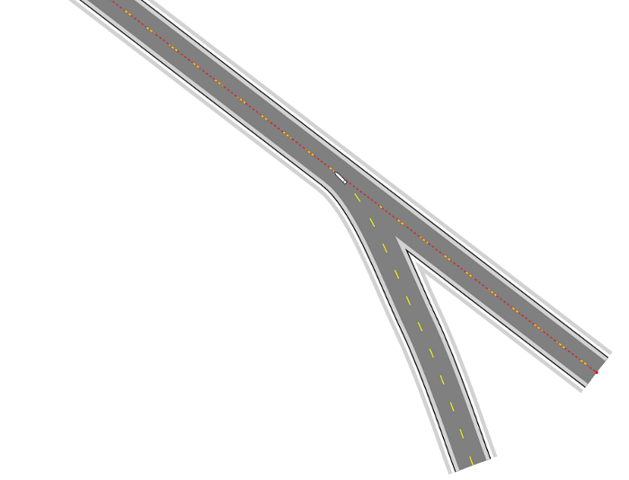
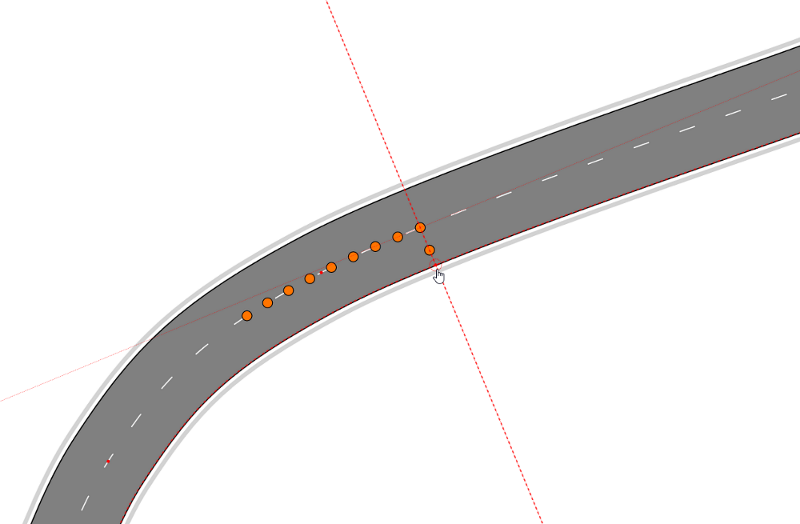
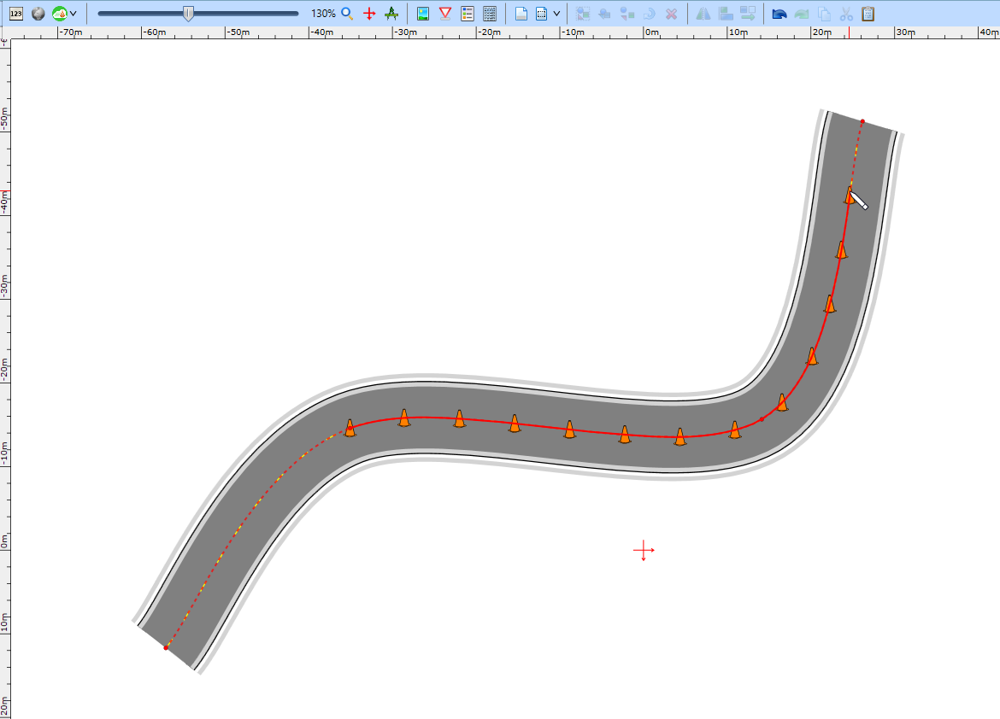
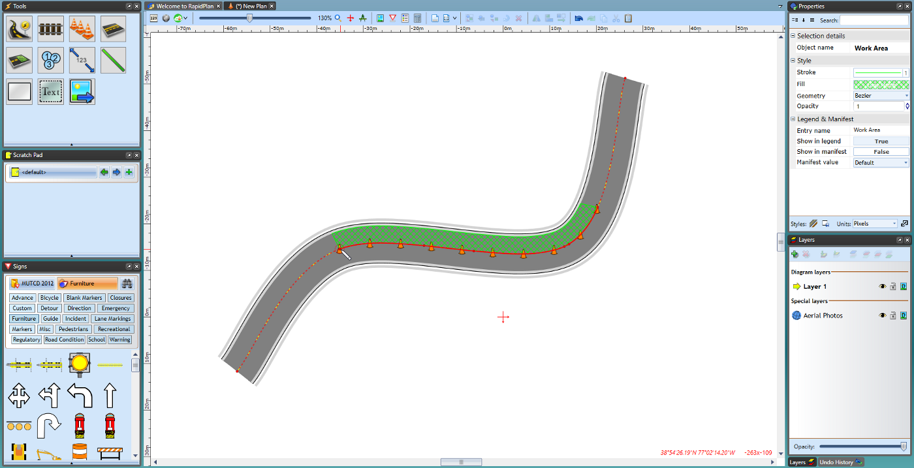
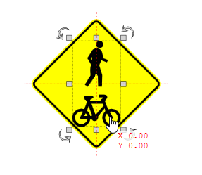
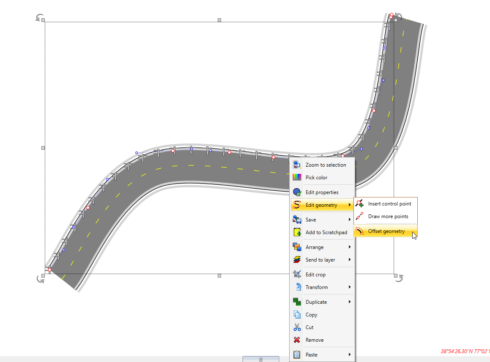
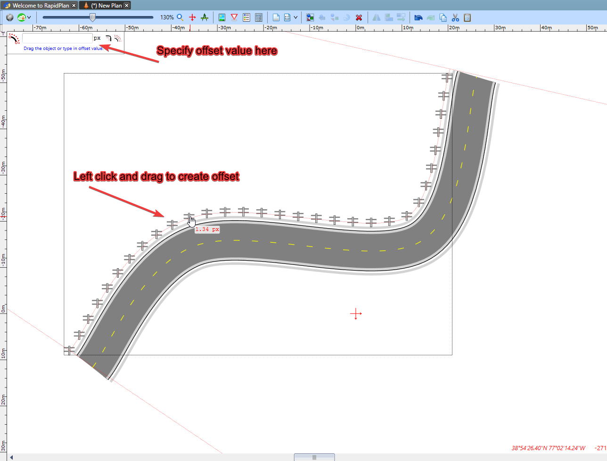

# Control points and snapping

Almost every drawable object in RapidPlan has one or more control points. These are the handles you use to shape geometry, align objects, and connect one object to another.

The control points along a road let you adjust its shape.

Callout boxes have two control points: one for the head and one for the tail.

To view an object's control points, select it first.

## Keep control points straight

Hold **Shift** while drawing or moving a control point to keep the segment straight.

This is especially useful when drawing straight roads, work areas, or marker geometry.

## Add or remove control points

You can insert extra control points into supported objects by right-clicking the object and choosing **Insert Control Point**.

Likewise, you can remove them with **Remove Control Point**.

## Point snapping

Once you have selected an object and can view its control points, you can connect objects by snapping into existing control points. Hold **Ctrl** while point-snapping roads, work areas, or other geometry and RapidPlan will merge them cleanly.

If you want to snap across visible layers or stages, hold **Ctrl + Alt** while drawing or transforming. That temporarily enables multi-layer snapping so you can align to objects outside the active layer.

## Multi-layer snapping

Multi-layer snapping lets you snap to objects on all visible layers, not only the active layer. This is useful on staged plans where the base stage contains roads, lanes, or permanent markings that should guide objects drawn on another stage.

Hold **Ctrl + Alt** while drawing or transforming objects to snap to objects on visible layers that are not hidden.

You can also snap not just to control points, but anywhere along a snappable geometry.

### Advanced snapping

Press **Alt** while snapping to a geometry to reveal additional guides such as:

- tangent lines
- perpendicular lines
- midpoints

### Drawing along geometries

Snap to an existing geometry while drawing and RapidPlan can automatically fit your new object to that geometry.

This is especially useful for drawing:

- delineators
- lane or edge-related objects
- work areas
- markers that need to follow an existing curve

Start by clicking on the geometry where you want the object to begin, then continue drawing along it.

While drawing, you can also move from one geometry to another by snapping successive points onto different existing objects.

### Snapping to bounds

When moving or scaling objects and print regions, their bounds edges and centers can snap to each other for quick alignment.

This is useful when aligning objects to:

- print region edges
- page layout elements
- custom sign artwork
- other rectangular objects

## Offsetting geometry

Use the Offset Geometry tool to further adjust the position of an object.

To use it, finish drawing the object, then right-click and choose **Offset geometry**.

Drag to the desired offset, or type an exact value in the offset dialog.

Right-click to save the offset when you are done.

### Offset settings

The offset dialog includes:

- **Round Corners** to smooth the resulting offset geometry
- **Object Offset Copy** to create a copy instead of replacing the original

## Tangent points in Bezier geometry

Tangent points are visible only when an object uses Bezier geometry. They let you shape smooth curves on either side of a control point.

There can be up to two tangent points per control point.

For more detail, see [Object geometry](/docs/rapidplan/object-properties-and-transformations/object-geometry.md).
