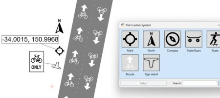

# Custom symbols

Custom symbols let you replace selected built-in symbols with your own reusable graphics.

## What custom symbols are for

Use **custom symbols** when you want to:

- match a company or client visual standard
- reuse the same approved symbol on many plans
- replace a built-in icon with a preferred local convention

## Supported objects

The unified custom symbol system is available on **selected objects**, including:

- bike lane
- north arrow
- **arrow board**
- LUMS board
- location marker
- sign stand

Support can expand over time, so check the **Properties palette** on the object you are using.

## How to use a custom symbol

1. Select a supported object.
2. In the Properties Grid, enable **Custom symbol**.
3. Choose the symbol you want to use from the custom symbol picker.

The object keeps behaving like its normal RapidPlan object, but its built-in symbol is replaced by your chosen custom one.

## When to use this feature

Custom symbols work well when the symbol itself should stay consistent, but the object still needs RapidPlan behavior such as:

- snapping
- geometry or placement logic
- **object properties**
- inclusion in legends or manifests where supported

## Related content

- Use [Location markers](/docs/rapidplan/the-tools-palette/the-marker-tools/location-markers.md) for map pin style annotations.
- Use [Signs palette](/docs/rapidplan/signs-and-scratchpad/signs-palette/signs-palette.md) when you need actual sign-library content rather than symbol replacement.
