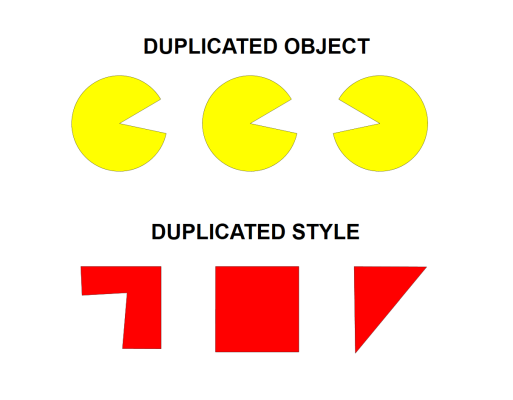

---

sidebar_position: 11

---
# Duplicating Objects and Styles

RapidPlan has made it simple to duplicate objects and/or an items property  onto another item.

## To Duplicate an Object

- **Right click** on the desired object to duplicate.
- Hover cursor over **Duplicate** in the contents menu.
- Select **Object**.
- Click to place as many duplicated objects as needed.
- or *Keyboard shortcut:* **Ctrl + D**

## To Duplicate an Object Style

- Right click on the desired object to duplicate it's style.
- Hover cursor over **Duplicate** in the contents menu.
- Select **Style**.
- Draw object with the duplicated style.
- or *Keyboard shortcut:* **Ctrl + Shift + D**

## Duplicating Styles onto Other Items

As shown in the image below, you can paste the style/properties of one item onto other items. This can be useful when, for example, you have different road tools in use (eg. road, roundabout, arc road) and you want to give them all the same style/properties.

**To duplicate a style onto a different item:**

- Select the item to duplicate style.
- Press **Ctrl + C**
- Now select item to transfer the style onto it.
- Press **Ctrl + Shift + V**
