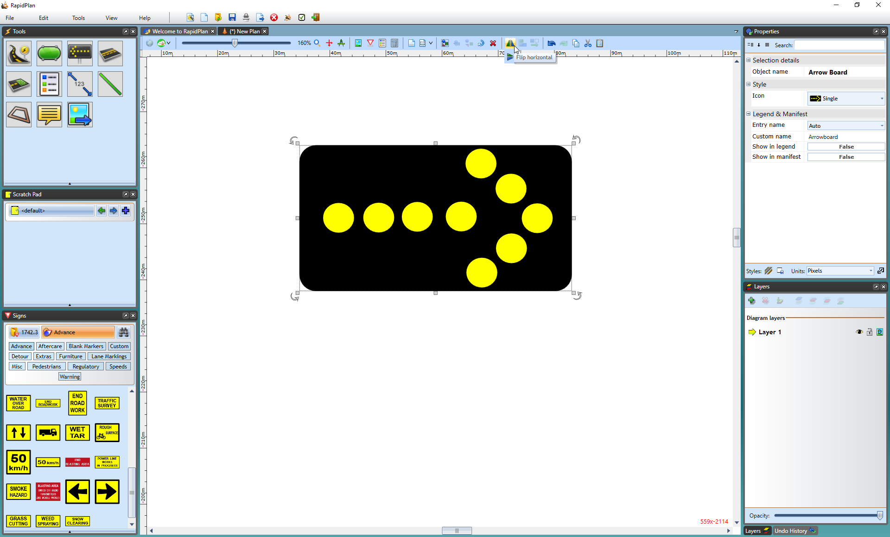

---

sidebar_position: 8

---
# Moving, Flipping and Rotating Objects

## Moving Objects

Of course there will be times when you will need to move a placed object  on the RapidPlan canvas. This is accomplished using the move handle.

### Moving one or more objects on the plan

- Select the item or items that you wish to move.
- Click and drag your selected object (if you have more than one object selected, you can use any of the move handles that are showing).
- For fine placement, you can use the cursor keys on the keyboard to nudge your selection into place.
- For larger nudging steps, hold **Shift** key in combination with cursor keys.

## Flipping Objects

As well as rotating objects, you can also flip them either horizontally or vertically using the flip buttons on the Flip toolbar. Note however, that the flip buttons are only ever visible when an object which can be flipped is selected. (Users of other drawing programs will recognize flipping as being equivalent to reflecting in the X or Y axes).

## Rotating Objects

Frequently it will be necessary to rotate an item on a plan. There are three methods of rotation:

- Free rotate with the rotation handle.
- **Right clicking** an object/tool and select **Transform** > **Rotate clockwise**, **Rotate counter-clockwise**, **Rotate upside down** or custom **Rotate by degrees** options.
- On selected object, **Right click** on Rotation Handles (curved arrows) on corners.
- Hit **Ctrl + R** when an object is selected and it will rotate in 90 degrees increments.
- Micro rotate clockwise with **Ctrl + Alt + R** or counter-clockwise with **Ctrl + Alt + E**.

    

    **Note:** You can rotate one or more selected objects at the time.
