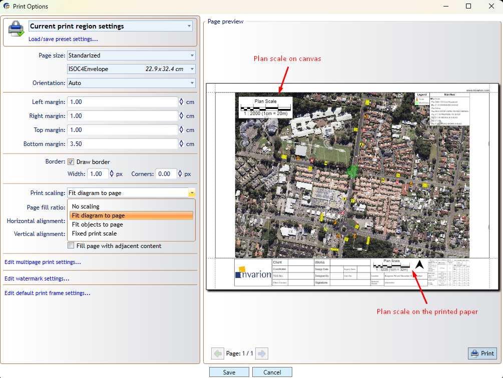

# Plan scale and print scaling

The scale shown on a RapidPlan plan can differ from the scale shown in its print frame. Use this article to understand why the values differ and how to keep a specific scale when printing.

## Why the scales can differ

The plan scale describes the scale used while working on the plan. The scale shown in the print frame describes how the plan content fits within the printable page area.

The printable area depends on:

- paper size
- page orientation
- page margins
- print scaling mode
- the size and proportions of the print region

If the printable area does not match the print region, RapidPlan may resize the content to fit. For example, a plan created at **1:2000** may show **1:3228** in the print frame after it is fitted to the available page area.

## Choose a print scaling mode

In **Print Options**, use **Print scaling** to control how RapidPlan places the plan content on the page.

RapidPlan provides four modes:

- **No scaling** keeps the content at its current size.
- **Fit diagram to page** scales the whole diagram to fit the printable page area.
- **Fit objects to page** scales the plan objects to fit the printable page area.
- **Fixed print scale** prints at a specific scale.

Select **Fixed print scale** when maintaining an exact output scale is more important than automatically fitting all content on the page. Check the **Page preview** to confirm that the required plan content remains inside the printable area.

## Adjust the page layout

If the result does not fit as expected, adjust the paper size, orientation, margins, border, or horizontal and vertical alignment. The **Page preview** updates as you change these settings.

## Related articles

- [Print regions](./print-regions)
- [Print frames](./print-frames)
- [In-place print preview](./in-place-print-preview)
- [Printing plans](../print-and-export-operations/printing-plans)
