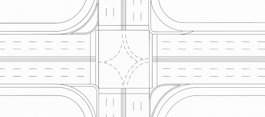

# CAD export

RapidPlan can export plans to CAD when you need to hand work over to AutoCAD-based or GIS-adjacent workflows.

## Supported output

RapidPlan supports CAD export to:

- `DWG`
- `DXF`

## What CAD export is for

Use CAD export when you need to:

- share a **traffic control plan** with CAD users
- place RapidPlan output into a wider design drawing set
- preserve georeferenced output for downstream spatial workflows
- export either worksite drawing content or print-frame content

## Modelspace and paperspace

RapidPlan supports both:

- **modelspace** for the main drawing content
- **paperspace** for print-frame based page layouts

That means the exported file can represent either the site geometry itself, the prepared print layout, or both depending on how your plan is set up.

## Georeferencing

One of the main reasons to use CAD export instead of PDF or image output is georeferencing.

If your plan is based on a mapped location, you can export CAD data with spatial reference information so the result is easier to align with:

- existing CAD base drawings
- survey or design files
- GIS or mapping workflows

## When to use other export types instead

Use **PDF** or image export when you mainly need something to print, review, email, or attach to approvals.

Use **CAD export** when the recipient needs editable drawing data or spatially aligned output.

See [Printing plans](./printing-plans) and [Georeferenced image export](./georeferenced-image-export) for those workflows.

