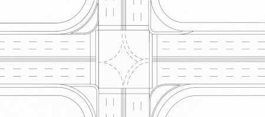
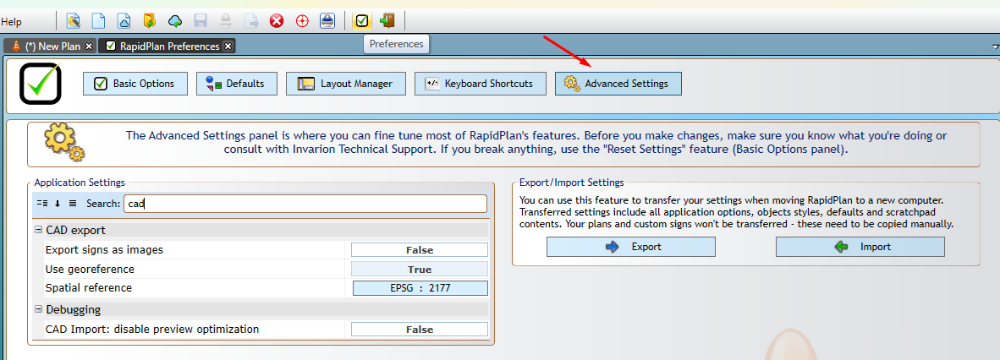
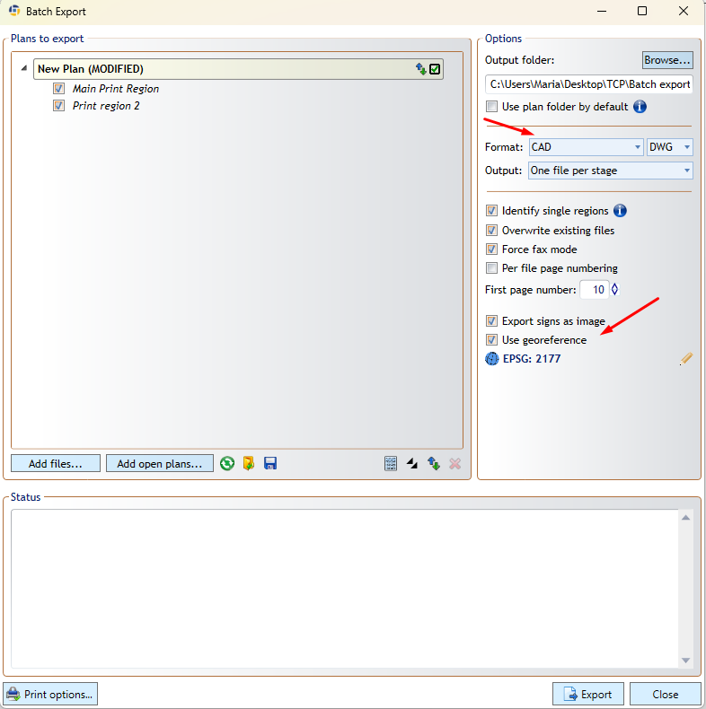

# CAD export

RapidPlan can export plans to CAD when you need to hand work over to AutoCAD-based or GIS-adjacent workflows.

## Supported output

RapidPlan supports CAD export to:

- `DWG`,
- `DXF`.

## What CAD export is for

Use CAD export when you need to:

- share a **traffic control plan** with CAD users,
- place RapidPlan output into a wider design drawing set,
- preserve georeferenced output for downstream spatial workflows,
- export either worksite drawing content or print-frame content.

## Modelspace and paperspace

RapidPlan supports both:

- **modelspace** for the main drawing content,
- **paperspace** for print-frame based page layouts.

That means the exported file can represent either the site geometry itself, the prepared print layout, or both depending on how your plan is set up.

## Export georeferenced CAD

Use georeferencing to keep exported CAD data aligned with its real-world location in CAD or GIS software.

To bring CAD data into RapidPlan, see [Import georeferenced CAD](/rapidplan/basemaps-and-spatial-data/importing-external-data/spatial-data-import#import-georeferenced-cad).

### Before you begin

- open or create a RapidPlan plan with a location and basemap,
- confirm the coordinate system required by the destination workflow. You may need its EPSG code.

### Export a georeferenced print region

1. Open **Preferences** > **Advanced Settings**.
2. Under **CAD export**, set **Use georeference** to **True**.
3. Select **Spatial reference**, then choose the coordinate system required by the destination workflow.

   

4. Return to the plan and activate the required **print region**.
5. Right-click **Print**, then select **Export this region** and the CAD export option.
6. Choose the destination and save the export.

RapidPlan creates a CAD file and a matching `.prj` file containing the spatial reference. Keep both files in the same folder. If you import the CAD file into RapidPlan later, RapidPlan can use the `.prj` file to select its spatial reference automatically.

### Export georeferenced CAD in a batch

1. Open **File** > **Export** > **Batch Export**.
2. Add the required open plans or plan files, then select the regions to export.
3. Set **Format** to **CAD** and choose `DWG` or `DXF`.
4. Optional: Select **Export signs as image** if signs should be rasterized in the CAD output.
5. Select **Use georeference**.
6. Select the spatial reference shown below **Use georeference**, then choose the required coordinate system.
7. Select **Export**.

The exported CAD files use the selected spatial reference. Keep each generated `.prj` file with its matching CAD file.

## When to use other export types instead

Use **PDF** or image export when you mainly need something to print, review, email, or attach to approvals.

Use **CAD export** when the recipient needs editable drawing data or spatially aligned output.

## Related articles

- [Spatial Data Import](/rapidplan/basemaps-and-spatial-data/importing-external-data/spatial-data-import)
- [Batch print and export](./batch-print-and-export)
- [Printing plans](./printing-plans)
- [Georeferenced image export](./georeferenced-image-export)
