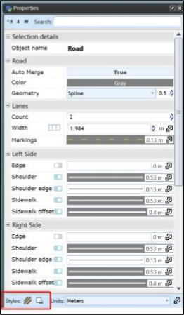

---

sidebar_position: 3

---
# Object Properties and Styles

## Properties

An important feature accessed through selecting an object is editing the object's properties. Every single object in RapidPlan has a set of **properties** which determine how that object appears on the canvas, that can be viewed and altered from the properties [palette](/docs/rapidplan/the-rapidplan-screen/your-workspace.md). 

The available properties will vary from object to object. The table below contains a few examples of different objects and some of their properties:

|Object                                                                            | Tools type |Example properties                                                                           |
|----------------------------------------------------------------------------------|------------|---------------------------------------------------------------------------------------------|
| Ellipse, Rectangle, Polygon, Rounded rectangle, Filled Bezier, Filled spline  | Shapes     | **Stroke** - width, color, style, cap  **Fill** - opacity, color, style  **Tension**|
| Delineator tool                                                                  | Devices    | **Positioning** - spacing, alignment, geometry style  **Delineators** - type, size      |
| Road tool                                                                        | Roads      | **Measurements** - units  **Road** - auto merge, color, geometry style  **Lanes** - count, width, markings  **Lane Markings** - width, color, style, dash and gap lengths  **Shoulders** - show left, show right, left shoulder width, right shoulder width  **Side-walks** - show left, show right, left width, right width, left offset, right offset  **Distance Markers** - spacing, show         |

Each object is drawn with it's default properties set, but you will undoubtedly want to frequently change an object's properties. Fortunately, this is very simple. Default preferences can be changed by clicking on
**Tools** > **Preferences**.

## View or Edit an Object's Properties

 As discussed previously, you can edit properties from the properties palette or using quick edit mode:

 Double click on the object you wish to inspect to open the Quick Edit box. The object's properties screen will appear. Note that the properties will be different for each object type.

 

Make any necessary adjustments to the settings.

The Preview window will show you any adjustments you've made.

Press Ok to complete your changes.

## Styles

If we expect to often use an object with a chosen series of properties settings, we may want to save it as a style. This way we can quickly set an object to the same settings in the future, saving time and adding consistency to your plans.

We can also set a **default style**, so that the next time you use that object, its properties will default to the style you prefer.

### Setting a Style

Once you have a altered the properties of an object on the Canvas Area, with the object selected you will see the two icons pictured below:

**A style is *set* using the icon on the right:** 

- **Save as Default Style** will without further input set that style to default.
- **Reset Default Style** will reset the default style for that object type to the bedrock, original default default that RapidPlan came with.
- **Save as New Style** will open the **Object Styles dialog window**:

The **Styles Dialog Window** pictured below is used for saving new styles, and updating/managing existing ones.

It can be vertically into two sections:

**The left side** displays the object type to which the styles we are viewing belong to, labelled *'Pick an object'*. And below, labelled *'Pick a style to edit'*, it lists the subsequent styles of the chosen object.

**On the right** is the *'Style details'* section: Here we see the details of the style that we are either viewing/editing, or creating for the first time (as we are discussing now). To save your style, simply give it a name, save an Icon and Description if you like, and click Save at the bottom of the screen.

### Applying an existing style

**To apply a style to an existing object:** With the object selected, click the button on the left in the Styles section at th bottom of the Properties menu. A list of all styles for that object will appear, and you can simply click the style you need.

**To select a style that you'll use to create a new object:** Find the object you plan to create in the Tools Palette (hover over the category of object and find the object in the drop down menu), right-click the object and find the preferred style under the 'Use Style' heading. Select this, and then then begin placing the control points of your object as you normally would.

### Altering and managing existing styles

Altering and managing existing styles is done through the **Object Styles dialog window**. This can be opened by clicking Tools > Object Styles.

As explained in the **'Setting a Style'** section, the Object Styles dialog window has a section on the left for finding the object, and then the style of that object that you wish to manage on the left.

Once the style is found, you can change it's details and/or properties before saving it. 

USing the buttons next to the **Save** button, a style can also be **deleted** using the red cross icon, **copied** to create a matching style that can then be altered, or **added to [Scratchpad](/docs/rapidplan/the-rapidplan-screen/the-scratch-pad.md)**.
