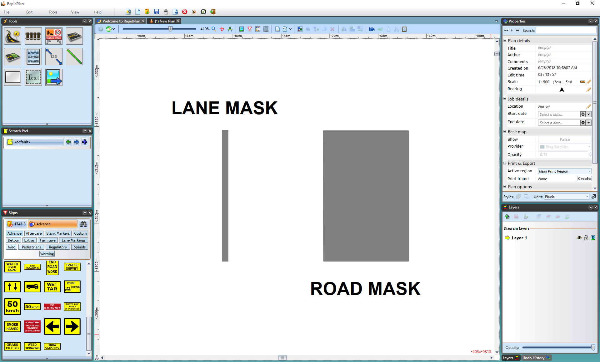

---

sidebar_position: 2

---

# Road Masking Tools

These road masking and marking tools are necessary if you need to remove and/or change lane markings on the road. All of these tools can be found in the **Markings** tab of the Tools Palette.

## The Lane Mask tool

Sometimes, it may be necessary to remove a small section of a lane marking on a road. This is often the case when building intersections. You can remove a small section of lane marking by using the Lane Mask tool. It's located within the Tools palette in the Markings tab.

**To mask out a lane marking:**

- Hover your cursor over **Markings** in the Tools palette
- Select the **Lane Mask** tool
- Click and hold the left mouse button on the marking, at the point you wish to start the mask
- Move the mouse along the line to lay out the mask
- On curves, you will need to click in turn points for your mask as it follows the road
- Right click to finish

    

The lane mask tool is no different to any other object in RapidPlan once it's been placed, you can select it and shift its control points if you didn't manage to completely cover the line in the first attempt.

## The Road Mask Tool

This tool operates similar to the Lane Mask tool and removes sections of lane markers but instead of covering only a lane width, you can cover an entire road to remove markers. This comes in handy particularly when you have several lanes on roads that meet at an intersecting point and you need to remove many lane markers.

**To mask out lane markings using the Road Mask Tool:**

- Hover your cursor over **Markings** in the Tools palette.
- Select the **Road Mask** tool.
- Start using the tool as you would use the Polygon tool drawing a perimeter of the road mask enclosing all the lane markers you want.
- Right click to finish.

    

Again, there are control points and resize handles to allow you to adjust the shape and size of the road mask.

