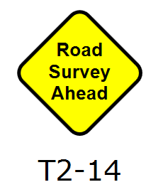

---

sidebar_position: 3
tags:
  - signs

---
# Creating your sign

You should now have a good understanding of what is inside a RapidPlan sign file, so now we can go ahead and make one.

The basic steps for creating a sign are:

- Create your base sign
- Create the black and white version
- Save the base sign
- Create and save the variations

The steps below use a fictitious sign to illustrate the process.

## Create a base sign

There are two methods that you can use to create your base sign. You can either start from scratch with new basic shapes, or you can ungroup an existing sign and use that as a template.

### Start by editing another sign

If your new sign is to be similar in appearance to an existing sign, or even if just the sign face is to be the same, it probably makes sense to use the existing sign as a base. Drop it onto the canvas, ungroup it and delete any unwanted elements.

### Start from scratch

If you want to start from scratch, there are a couple of guidelines you should adhere to:

- **Sign frame**: You should ensure that the line stroke width for the frame of your sign is 1.5 pt or above.
- **Size**: Try and keep you signs roughly the same size as the original ones packaged with RapidPlan.
- **Font**: Whilst the font isn't critical, the size is. Try to keep your font to a minimum 8pt or above,
bold setting (all the default signs use Arial).

### Use components from other signs

You aren't limited to just using the frame of other signs - if there is a graphic on any of the other signs in the package, you can use that too. Simply ungroup the sign and move the elements that you need onto your own new sign.

### Complete your sign

When you have finished creating your sign, drag a **selection box** around your sign and select the **Group** objects icon in the toolbar , **Ctrl + G** or right-click and select **Group objects**.
