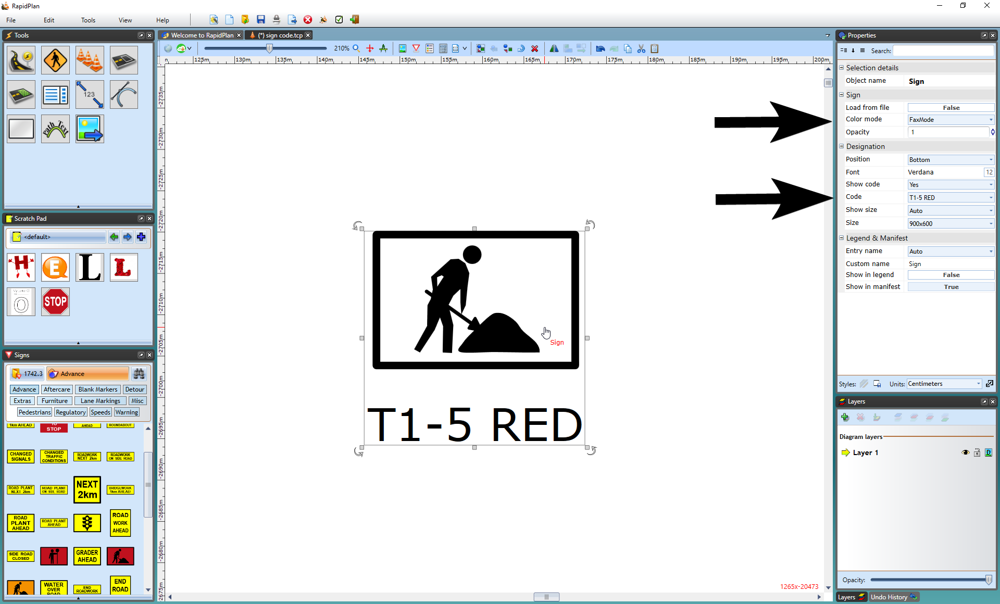

---

sidebar_position: 4
tags:
  - signs

---
# Choosing the displayed variation of a sign

Because there are often multiple versions of the same sign, you need to tell RapidPlan which version you want to use on your plan if the default variation is not suitable (by default, the standard sign with no code will be displayed). Changing the variation is easy.

**To set a different variation of a selected sign:**

- Select the sign and go to the **Properties palette**.

- Change **sign variations** as needed. The example below changes the sign to allow Fax mode with no color and to show its sign code.

**Note:** To change variations for all signs in the plan, use **Toggle Color/Fax mode** or **Sign Designation** on the toolbar. See [Fax mode](/rapidplan/printing-and-export/print-and-export-operations/fax-mode) for related output behavior.
