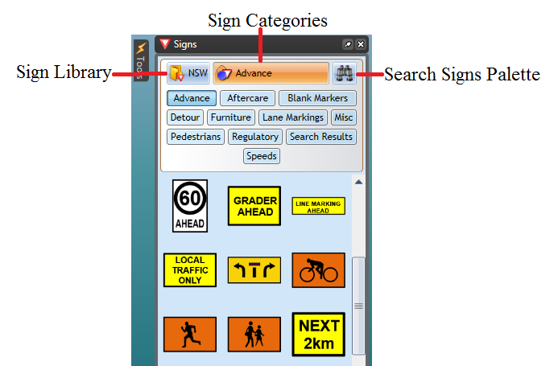
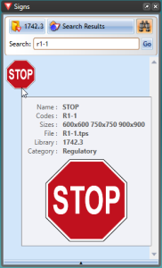
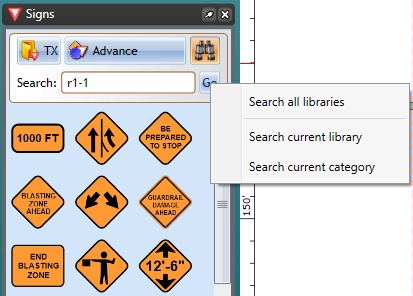
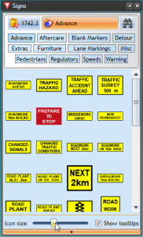

---

sidebar_position: 1
tags:
  - signs

---
# Signs palette

The **Signs palette** is the repository for each of the signs in RapidPlan. Aside from the signs themselves, the **Signs palette** has three main components:

- Sign library.
- Sign categories.
- Search signs.

## Sign library

This drop down control allows you to select which signage pack you wish to use. In some cases you will only have one pack installed, but certain countries will have numerous state/region packs also installed. Changing the sign pack often changes sign tab options.

## Sign categories

The signs are organized into tabs so that they are easy to find. Clicking through the tabs will reveal the
signs for each category. You can view and example of the categories in the image below.

## Search signs

Use the search field to find signs by keyword, phrase, sign name, or sign code. For example, you can find a STOP sign by entering `stop` or its local sign code, such as `R1-1` in Australia.

Use the search scope menu to choose where RapidPlan searches:

- **Search all libraries** searches every installed sign library.
- **Search current library** searches the sign library currently selected in the Signs palette.
- **Search current category** searches only the category currently open in the selected sign library.

**Note:** Sign codes vary by country and sign library.

## Setting the sign icon size in the palette

You can change the size of the signs in the palette. This is helpful when using a screen at very high resolution, or just for users who are having difficulty with the small icons. By default the sign icon size on the palette is set to medium.

**To change the signs icon size:**

- Click on the bar at the base of the **Signs palette** to make options appear.
- The size bar will pop up enabling you to select a different size (see below).

