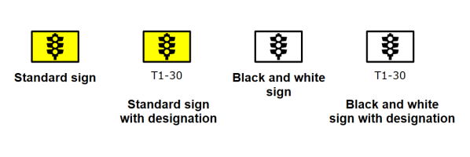

---

sidebar_position: 5
tags:
  - signs

---
# What is in a sign?

This article explains how RapidPlan signs are stored and why a sign can have multiple variations. Understanding this helps when you need to choose or create a sign variation.

Each sign in RapidPlan has its own sign file saved on your computer, and almost every sign file contains multiple variations of the same sign. A typical sign has four variations.

The reason behind the multiple variations lies in the features of the RapidPlan canvas:

- When Fax Mode is selected, the signs need to be able to be displayed in black and white.
- When Sign Designations are turned on, the software needs to be able to display a variation of each sign with its code.
