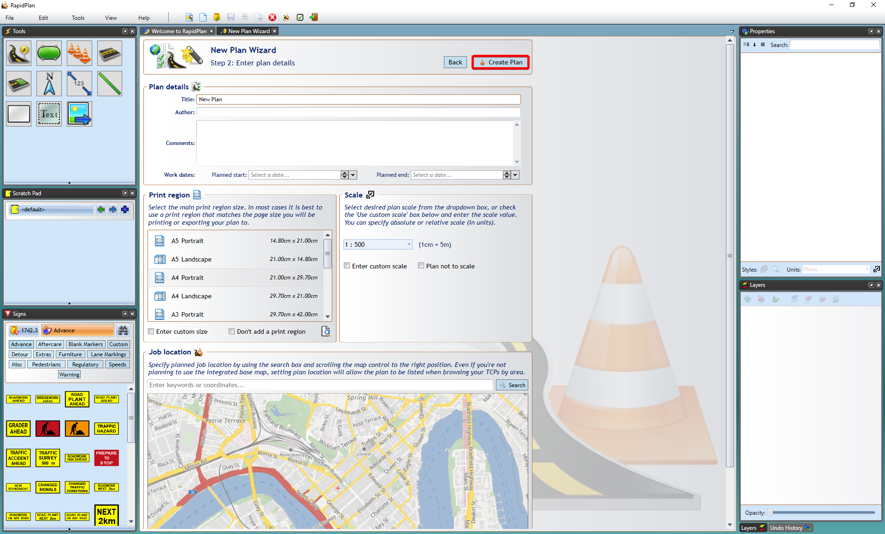

---

sidebar_position: 3

---
# Auto Template

The purpose of the Auto template tool is to semi-automate the process of creating a traffic plan.

Auto templates are capable of laying out basic signage and work site devices at a selected works location.

This also includes parameters such as sign spacing and sign placing. These parameters are calculated based on road properties such as the road category and the marked speed.

*Disclaimer:*
*The information presented in the auto templates is to be regarded as guidance, and should be altered, when necessary, to fit the conditions of a particular temporary traffic control zone*

*Procedures for establishing temporary traffic controls depend on a number of conditions (road configuration, location of the work, work activity, duration of work, road user volumes, road vehicle mix, road user speeds) and can therefore vary. Selection of the most appropriate template, to use as a guide for a specific work zone, requires an understanding of each situation.*

## Creating a plan in the Auto Template tool

- Select a template from the list of modules available below, once selected, click **NEXT**.
- ***Please note*** - The *Generic Works* modules are intended for use in all regions. The templates therefore do not contain region-specific signs. If using the template as a starting point for your traffic plan, just add signs for your region, as required.

- Once you have chosen a template, search for the specific worksite location and click **NEXT**. You will then need to select the road where work will take place. Selectable roads are highlighted in green when you hover over them. Once the road is been selected, click **NEXT**.

- Once you have the road selected, mark out the start and end of your works. This is done by **Left clicking** the first point for start of the works, then the second point for the end.

- Specify your road dimensions - road width and shoulder width, then click **NEXT**.
- You *may* be asked further details, such as *taper length*, and whether or not a *buffer zone* is required, this will differ for each region and for the specific template you select.

- Next, add your Plan details as you would like with any other Plan type (i.e., page size, scale, etc). When this is done, click **Create Plan**.

- You will then be presented with your auto template on the canvas area. In the top left of your canvas area you will be presented with a dialogue box, this just confirms your widths and tapers. You can adjust them further, if required.
- Clicking the **Invert** button will switch your works to the opposite side of the road. **Reset** will set the parameters back to their defaults.
- When all the information is correct, hit **Complete** and the final template is generated on the canvas area.

