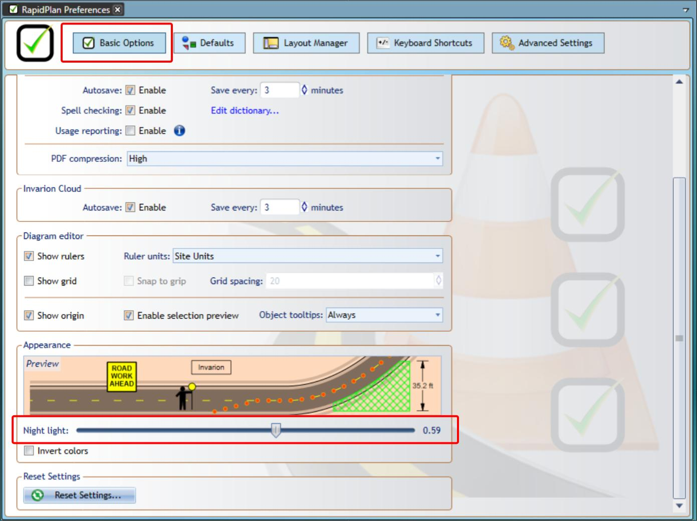

# Managing preferences

The Preferences area contains application settings for units, autosave, spell checking, editor display, keyboard shortcuts, layouts, defaults, and advanced behavior.

Open it from **Tools** > **Preferences**.

## Basic options

Basic options include application-wide behavior such as:

- units of measurement
- export compression
- autosave behavior
- spell checking
- usage reporting

## Diagram editor

Diagram editor settings control how the plan editor is displayed and how it behaves while drawing.

Common options include:

- showing rulers
- showing the grid
- showing the plan origin
- showing object tooltips
- grid snapping behavior

## Appearance

Appearance settings include reduced eye strain options such as **Night Light** and inverted colors.

## Layout manager

Use the Layout Manager to control the position and visibility of **RapidPlan** palettes such as Tools, Properties, Layers, and History.

You can drag palettes by their header bars, dock them to the available drop targets, hide them, or restore a saved layout.

The default layout is **Advanced**. If you customize a layout, save it before switching to another layout.

## Reset settings

Use reset options when you want to return settings to their defaults.

For object and plan defaults, see [Plan and object defaults](./plan-and-object-defaults.md).

