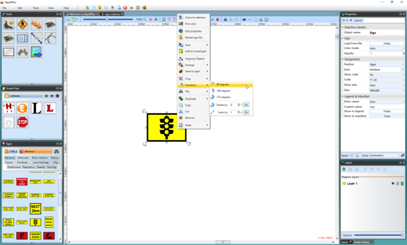
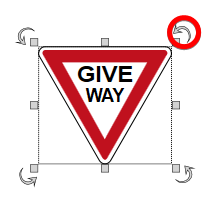
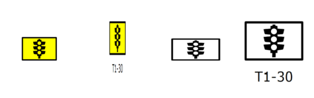

---

sidebar_position: 2

---
# Using the Signage

## Placing Signs

Placing signs is simple. Once your sign is placed you can move, resize and rotate it.

### To place a Sign

- Select the desired sign from the **Sign Palette** by clicking on it.
- Float the sign out onto the canvas with the mouse. (You don't have to hold the mouse button
while you drag your sign.)
- If you want to rotate your sign 90 degrees; use **Ctrl + R**.
- Click to drop the sign on the canvas.

## Rotating placed Signs

As is the case for most RapidPlan items, once a sign is placed on the canvas, there are three ways to rotate it.

Whilst free rotate is probably the easiest to do, it probably isn't ideal if you are aligning more than 1 sign. It
can be fiddly to get signs all pointing in precisely the same direction, so often you are better off using the
right-click Rotate option, or **Ctrl + R**.

### To rotate in set 90 degrees increments

- Select the placed sign
- Press **Ctrl + R** repeatedly to rotate the sign 90 degrees clockwise

### To rotate by set angle

- **Right click** on the sign to reveal the context menu.
- Click on **Transform** >  **90 degrees**, **180 degrees**, **270 degrees** or **Rotate by custom value**

### To free rotate

- Select the sign that you wish to rotate. The rotation handles will become available for use.
- Using the rotation handle, drag the sign around until it is positioned as you require.

    

    **Note**: The rotation handles are the arrows placed at each corner of the sign, the arrow will turn red when the cursor is place over of it which means it is ready to use.

## Resizing Signs

Resizing signs in RapidPlan is no different to resizing any other object. Its achieved using the resize handles which appear when the sign is selected.

The sign is resized by simply dragging out the resize handles. However, there is one important factor that you should take into account when resizing your signs. If you want to keep the sign in proportion with itself while you resize, you must hold **Shift** as you resize it.

In the example below, we start with a regular sign, then resize it twice without holding **Shift**. The final resized sign did make use of the **Shift** key, ensuring it is kept in proportion.

