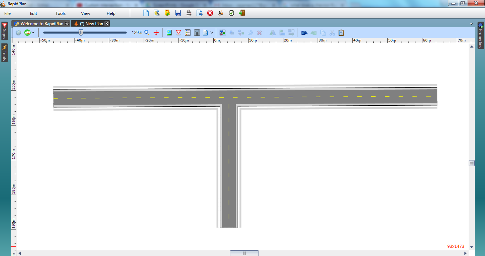
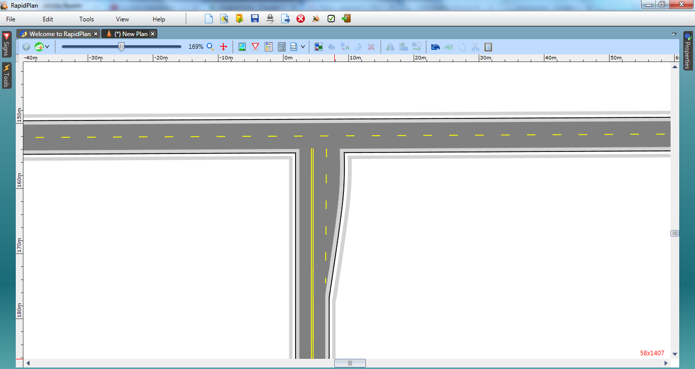
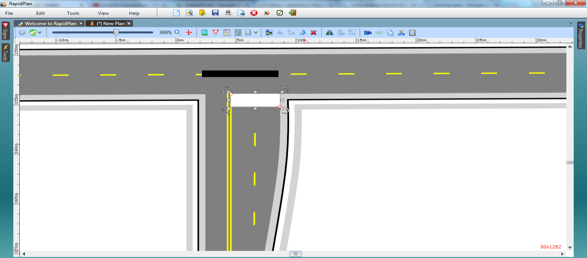
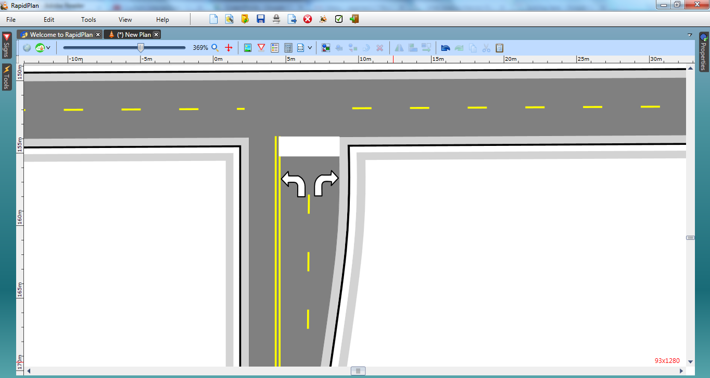

---

sidebar_position: 2

---
# T-Intersections

T-intersections are the easiest of intersections to create in RapidPlan because the **Roads** tools make the task of joining roads at angles simple.

|T-intersection                                     |                            |
|---------------------------------------------------|----------------------------|
|  | **This simple T-intersection makes use if the following items:** - Road tool  - Turn Lane tool  - Lane Marker tool  - Lane Mask tool  - Rectangle tool  - Furniture from Signs Palette  |

## Create the Base Roads

1.Select the **Road** tool from the Roads tab in the Tools Palette and create an east-west road of two lanes.
2.Add a north-south road of two lanes as shown.

    

3.Select the **Turn Lane** tool in the Roads tab of the Tools Palette and place it next to the right lane of the north-south road.
4.Click once to begin drawing the Turn Lane, click again mid-way to create the curve in the lane and click once more where the lane intersects the east-west road.

    

## Changing the Lane Markers

5.Select the **Lane Marker** tool in the Markings tab and draw a lane marking for the turning lane.

6.Now **Double click** on the north-south road, select the Lanes tab and change the lane marker to double in the Markings section.

   

## Configuring the Road Markings

7.With the **Lane Mask** tool, mask out the broken line on the east west road across the intersection. (To make this clearer, we have drawn the lane mask in Black for this tutorial).

    

## Adding the Stop Bar and Turning Arrows

8.Select the **Rectangle** tool from the Shapes tab in the Tools Palette and draw a rectangle for a stop bar. It pays to zoom right in when doing this.
9.**Double click** on your drawn rectangle and change the **Stroke** color to white.

    

10.Select a **turn arrow** from the Furniture tab located within the Signs Palette and place it in the left lane. Select another and place it in the other northbound lane. You will need to flip this one horizontally using the flip function on the Flip toolbar as shown.

    
