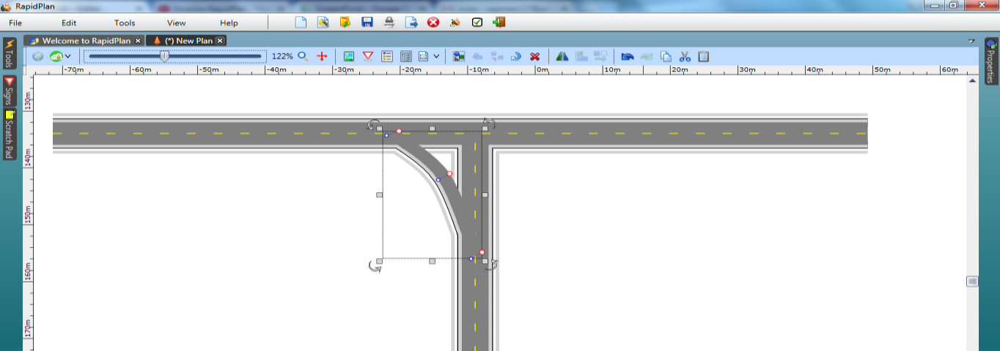

---

sidebar_position: 5

---
# Slip Lanes

One of the most important skills in RapidPlan is learning to make slip lanes. Fortunately, they are very simple to do.

|Slip lane                                     |             |
|----------------------------------------------|-------------|
|  | **This T-intersection with a Slip Lane makes use if the following items:** - Road tool  - Lane Mask tool  - Rectangle tool  - Control Points  - Furniture from Signs Palette    |

## Create the Base Roads

1. Select the **Road** tool from the Roads tab and create an east-west road of 2 lanes, then add a north-south road.

    

## Create the Slip Lane

2.Select the **Turn Lane** tool from the Roads tab and create a diagonal road as shown below.

    

3.Move half way along the Turn Lane, **Right click** and select **Insert control point**. Move the control point to shape the road to a fluid curve as shown.

    

4.Add any necessary pavement markings.

    
