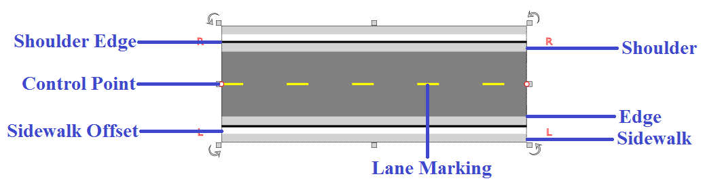
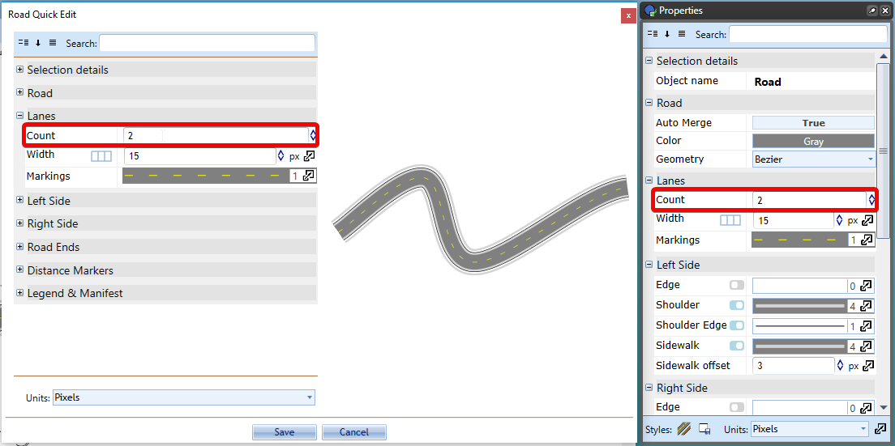

---

sidebar_position: 1

---
# Drawing a Road

## Components of the RapidPlan Road

The road has a number of different parts. It is well worth familiarizing yourself with them.

## Basic drawing techniques

Drawing using the road tool is very simple. As you move the mouse after you have clicked to start drawing, the roadway will "snake" behind the cursor. Each time you click the mouse on the canvas, a new turning point for the road is placed. The turning point is represented by a control point.

### To draw a Road

- Select the **Road** from the Tools palette.
- Move your mouse to the canvas and click once to start drawing your road.
- Move the mouse around the canvas, clicking at each turning point.
- When you have placed your final point, **Right click** to stop drawing.
- If you don't want to draw another road, **Right click** again to drop the road tool.

### Keeping Sections straight

A simple trick allows you to draw perfectly straight roads. By holding **Shift**, RapidPlan will make sure that each control point is placed in a perfectly straight line.

### Setting the number of Lanes on the Carriageway

There are two simple ways to add and remove lanes to roadways:

1. **Double click** on the road to be altered to bring up the Quick Edit screen
2. Select the object and change the number of lanes from the Properties palette within the right pane.

### Inserting Road Ends

There will be occasions where you need to insert a road end or a dead-end road. To do this we simply make a road and change its properties as seen in Figure 6.6.

You can select from flat, round or cul-de-sac. You can adjust sizing and control point of inserted road end.
