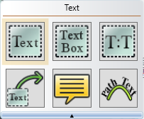
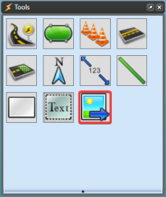

---

sidebar_position: 1

---
# The Basic Tools

*The building blocks of RapidPlan...*

There will be occasions where you need to build something for your plan that isn't included in the galleries. You might want to build some sort of landmark (like a mail box, or hydrant) to indicate the start of a job or you might use special equipment in your work that we haven't included. For this reason, RapidPlan has a wide range of basic tools including a variety or shapes, line tools, text tools and image importing which you can use to draw virtually anything you need.

The other very important purpose of these basic tools is to allow you to create signs. Every sign in RapidPlan is a collection of these basic tools which have been grouped and saved.

## The Tools

There are 20 different basic tools you can use. The majority are classed as either lines, or shapes. The Text and Image tools operate differently to all the others.

To see broken down listings of each class of tool, please visit [The Tools Palette](/docs/RapidPlan/the-rapidplan-screen/the-tools-palette.md) page.

|The **Lines tools**|The **Shapes tools**|The **Text tools**  |The **Image import tool**|
|----------------------------------|------------------------------------|----------------------------------|----------------------------------------|
|          |           |           |                |

**Note:** The Arrow, Text Arrow and Callbox are all covered in the marker tools sections ([part 1](/docs/rapidplan/the-marker-tools/the-six-distance-markers-pt1.md) and [part 2](/docs/rapidplan/the-marker-tools/the-six-distance-markers-pt2.md)).
