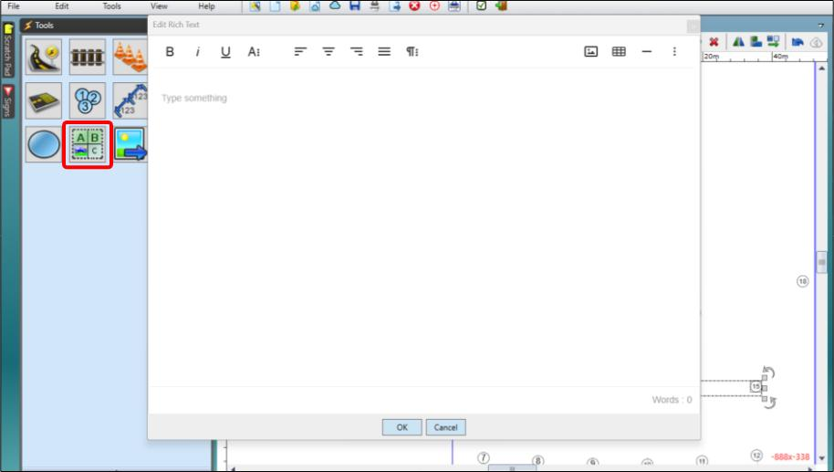
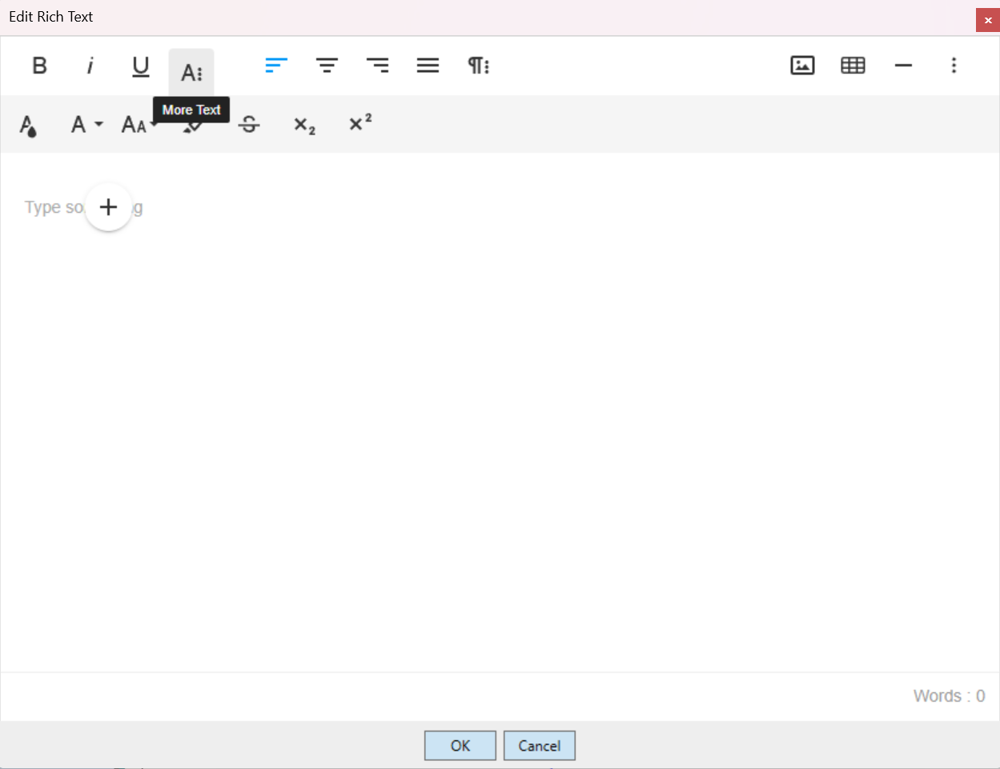
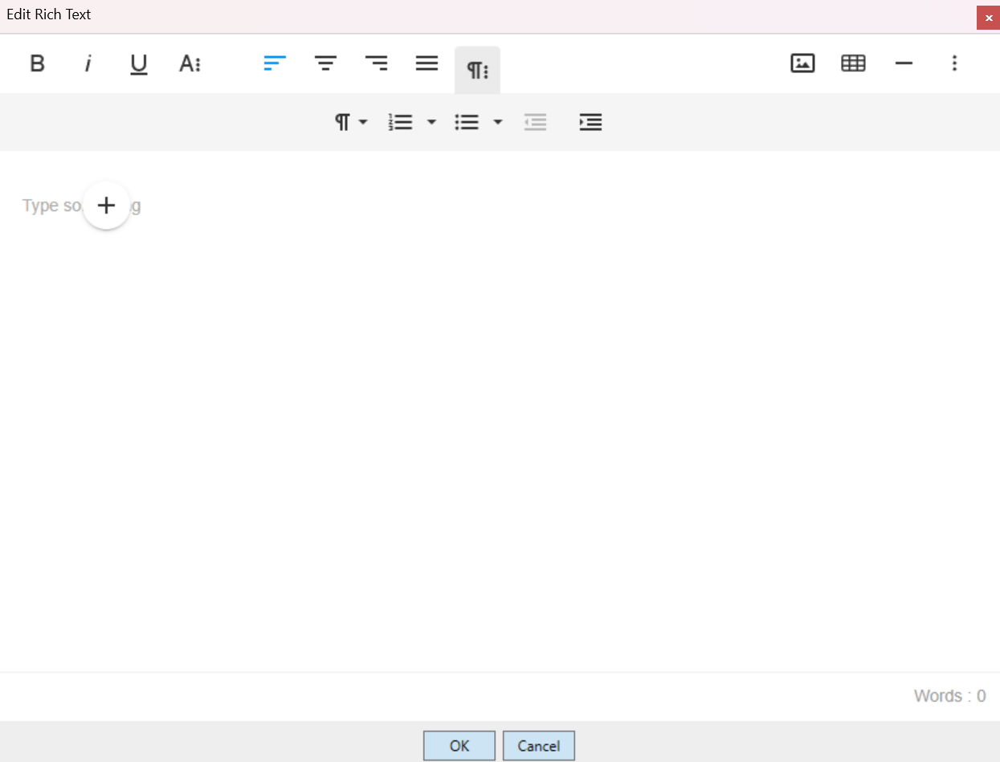
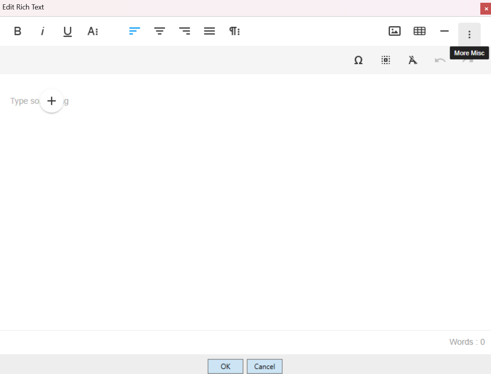
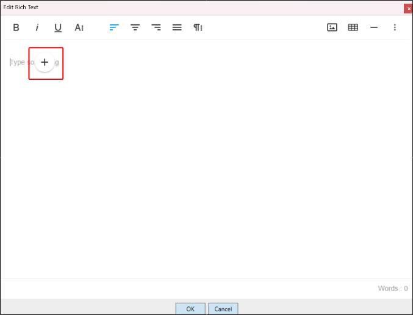
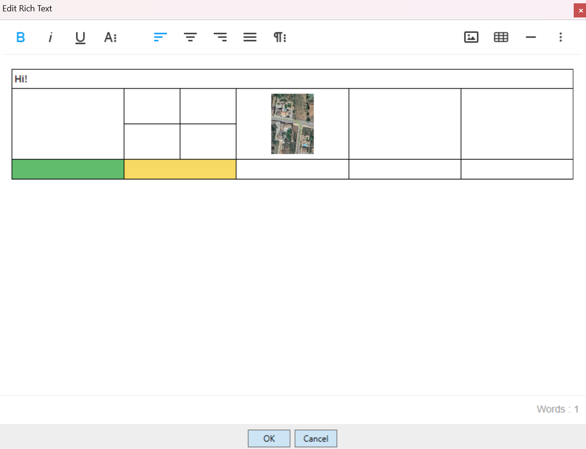

---

sidebar_position: 3

---

# Rich Text Editor

The Rich Text Editor allows for a more vibrant and varied mix of formatting and arrangements. It also allows for in-line image importing and table creation.

The Rich Text Editor is unique to the other editors. Clicking the icon shown in the image below opens a window where the text can be assembled and edited before being placed on the plan by clicking **OK**.

## The Rich Text Interface

Once open, you'll see familiar text editing iconography:

- **On the left:** Bold, italics and underlining.
- **In the center:** Alignment settings.
- **On the right:** Buttons to insert an image, a table, or a horizontal line.

There are also drop-down buttons:

### More Text

The **More Text** button opens a drop-down menu for additional text controls:

- **Text Color**
- **Font**
- **Text Size**
- **Background Color (highlighting)**
- **Strike-through**
- **Subscript**
- **Superscript**

### More Paragraph

The **More Paragraph** button opens a drop-down menu for additional paragraph controls:

- **Paragraph Format:** Switch between varied heading sizes and normal body text.
- **Ordered List:** Insert a list ordered by numbers and other numerals.
- **Unordered List:** Dot points and similar.
- **Decrease Indent**
- **Increase Indent**

### More Misc

The **More Misc** button opens a drop-down menu for these controls:

- **Special Characters**
- **Select All**
- **Clear Formatting**
- **Undo**
- **Redo**

### Quick Insert

The **Quick Insert** button is visible when the cursor is on an empty line, and reveals a list of objects that can be inserted when clicked:

- **Image**
- **Table**
- **Unordered List**
- **Ordered List**
- **Horizontal Line**

**Note:** Tools accessed through Quick Insert will be set to their default settings. If they are accessed through the Rich Text Editor's toolbar, you will be offered more options to customise the insert.

### Rich Text Table

Once a table is created, changes can be made to cells using all of the toolbar functions above, as well as using the context menu that appears when a cell or cells are selected.

Using a table's context menu:

- Rows and columns can be inserted or removed.
- Borders can be engaged or disengaged.
- Cells can be split horizontally or vertically.
- Cells can be merged.
- Background color can be applied, and vertical or horizontal text alignment can be applied.

A column's width can also be adjusted by clicking and dragging it.

## Placing a Rich Text Object on a Plan

Once your work is complete, click **OK** to place the rich text object on your plan. You can still edit its contents once placed by double-clicking it.

Once it is on the canvas area, it has the normal control handles to rotate and resize it.

If you would like to alter the Rich Text object's aspect ratio, such as portrait or landscape, this can be manipulated without stretching by using the two control points in the top-left and bottom-right corners.
