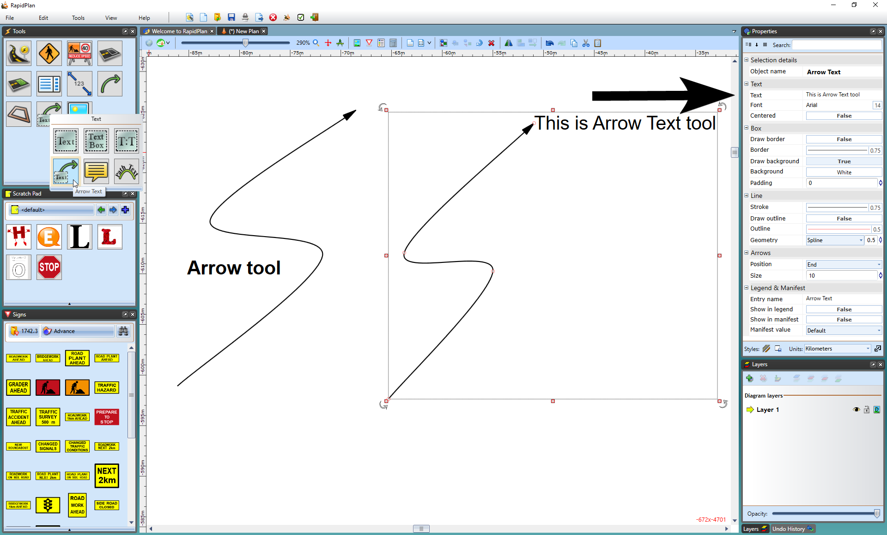
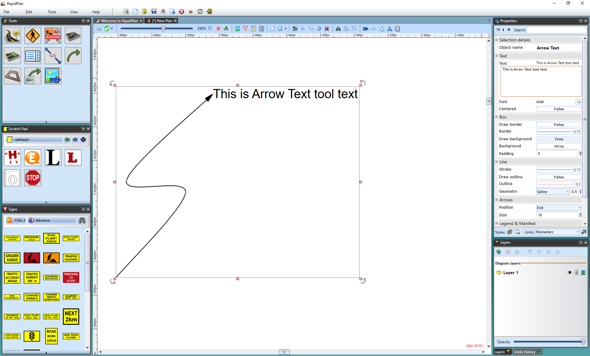

---

sidebar_position: 16

---
# Arrows

Frequently, you will need to draw attention to items on the plan, but will not want to use a callout box. RapidPlan provides two arrow tools for this purpose:

- The Arrow Tool
- The Arrow Text Tool

As the names suggest, the latter carries a text component at  its base. The arrows can be curved or straight, as shown.

## Creating an Arrow

- Select the **Arrow** tool from the Lines tab in the Tools Palette.
- Click to place the head of the arrow.
- Click again for each subsequent turn point that you require.
- When you have placed your final point, right click.
- Right click to clear the cursor.

## Creating an Arrow Text

- Select the **Arrow Text** tool from the Text tab in the Tools Palette.
- Click to place the head of the arrow.
- Click again for each subsequent turn point that you require.
- When you have placed your final point, Right click and a text cursor will appear for you to write your text in (**Note**: This can be edited in the Properties Palette).

    

    **Note**: To create a straight arrow, hold **Shift** whilst drawing the arrow.
