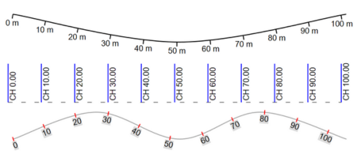

# Chainage markers

The Chainage Marker tool creates chainage references along a line, spline, or Bezier path.

## What the tool does

Chainage markers automatically generate:

- ticks at a chosen spacing
- labels showing chainage values
- a path that can follow linear geometry on the plan

This is useful for roads, corridors, paths, and other long linear features where you need repeated position references rather than a single measurement.

## Typical workflow

1. Select the **Chainage Marker** tool.
2. Draw or define the path it should follow.
3. Set the tick spacing.
4. Adjust label position, alignment, and orientation in the Properties palette.

## Why use chainage instead of distance markers

Use a regular [Distance Marker](./distance-markers.md) when you need one measured span or a small set of spans.

Use a Chainage Marker when you need a continuous sequence of references along a route.

## Related snapping behavior

Chainage markers work best when the source path is drawn accurately. Use [Control points and snapping](/docs/rapidplan/object-properties-and-transformations/control-points-and-snapping.md) to:

- snap onto existing geometry
- follow curved alignments
- position labels and ticks more precisely
