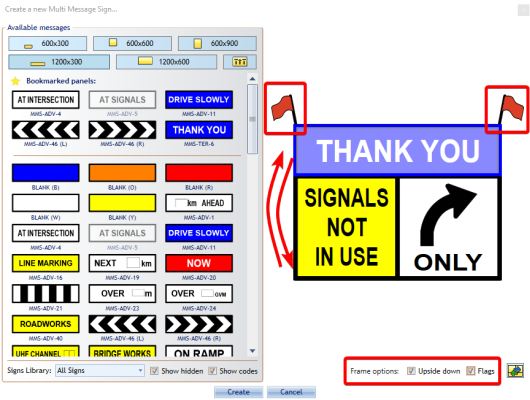
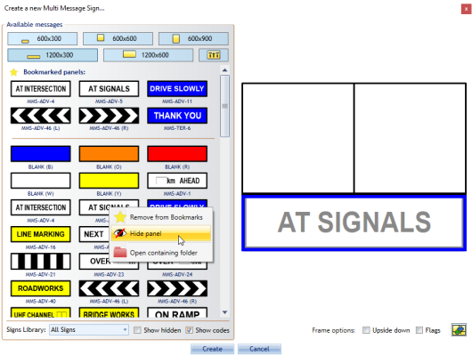

---

sidebar_position: 6

---
# The Multi Message Marker (Australian Version Only)

This marker operates very similar to the Lane Status marker in that it allows for the creation of one message board which displays multiple signs. The main difference between the two markers is that the Multi Message marker displays actual signs with messages as the marker implies, as opposed to only allowing for Lane Status signs to be used when working with the Lane Status marker.

There are five different sign sizes you can work with, each size tab will display the signs available within that size category.

|Image                                      |Sign size  |Available signs                                                                |
|-------------------------------------------|:---------:|-------------------------------------------------------------------------------|
| |600x300    |2 signs of this size can be used with one 1200x600 sign or two 600x600 signs.  |
| |600x600    |2 signs of this size can be used or one 1200x300 sign or two 600x300 signs.    |
| |600x900    |2 signs of this size can be used.                                              |
||1200x300   |1 sign of this size can be used with one 1200x600 sign or two 600x600 signs.   |
||1200x600   |1 sign of this size can be used with one 1200x300 sign or two 600x300 signs.   |

## Creating a Multi Message Sign

When this tool is selected, a **Multi Message Sign Wizard** box will appear where you make all the necessary adjustments to the message board you will be utilizing in your plan. You will have many different signs to choose from and select up to four signs for the message board. You can filter signs by state's library (**QLD**, **SA**, **VIC**, **WA**) and you can have your own **Custom Signs**.

**Multi Message sign placement:**

- Select the **Multi Message Sign** tool from the Devices tab in the Tools Palette
- Toggle through the size tabs to view the signs available in each size category and preview the placement of each sign in the preview pane on the right
- Select the signs and placement you want to add to the message board
- Click **Create** to update the marker

    

Click on **Upside down** checkbox if you need to replace pane position and **Flags** if you need on top corners of Multi Message Sign.

If you use some of the signs very often, you can bookmark it. **Right click** on sign you want to place on **Bookmarked panels** and select **Add to Bookmarks**. To remove it from **Bookmarked panels** **Right click** on bookmarked sign and select **Remove from Bookmarks**

If there are some signs that you never use them, you can hide it from your signs list. **Right click** on sign you want to hide and select **Hide panel** (**Note:** It will be hidden even if it is placed on **Bookmarked panels**).

To show hidden signs, click on **Show hidden** checkbox and you will see all the signs. Hidden signs will be grayed out.

## Adding a Lane Status Sign to your Multi Message Marker

You can also add a Lane Status sign to your Multi Message sign in the 600x600 size for two lanes, or 1200x600 size for four lanes.

**Adding a Lane Status to you Multi Message sign:**

- Select the desired size depending on number of lanes.
- Select the Lane Status Icon (see below).
- You will be directed to select a Lane Status Arrow for each lane.
- Select **Save** and complete your Multi Message Sign and select **Create**.

    

    

    
