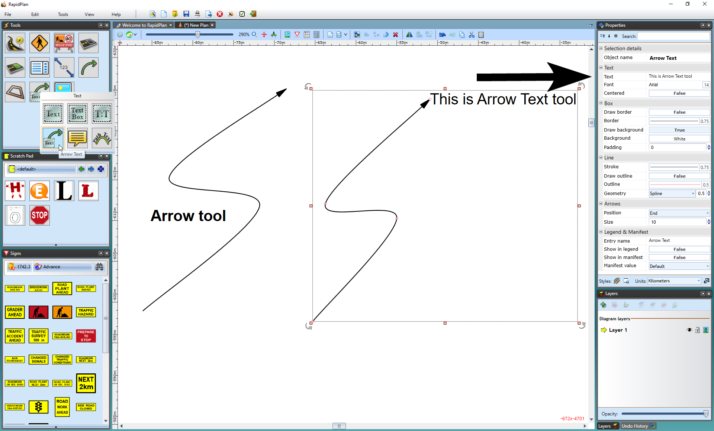
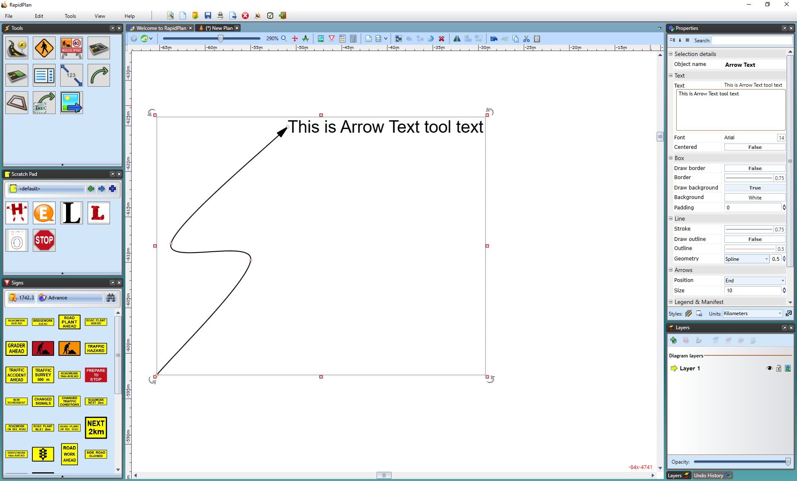

---

sidebar_position: 16
tags:
  - markers-devices

---
# Arrows

Frequently, you will need to draw attention to items on the plan, but will not want to use a **callout box**. RapidPlan provides two arrow tools for this purpose:

- **Arrow** tool.
- **Arrow Text** tool.

As the names suggest, the latter carries a text component at  its base. The arrows can be curved or straight, as shown.

## Create an arrow

1. Select the **Arrow** tool from the Lines tab in the **Tools palette**.
2. Click to place the head of the arrow.
3. Click again for each turn point that you require.
4. After placing the final point, right-click.
5. Right-click to clear the cursor.

## Create an Arrow Text object

1. Select the **Arrow Text** tool from the Text tab in the **Tools palette**.
2. Click to place the head of the arrow.
3. Click again for each turn point that you require.
4. After placing the final point, right-click. Enter the text when the text cursor appears. You can edit the text later in the **Properties palette**.

    

    **Note:** To create a straight arrow, hold **Shift** while drawing it.
