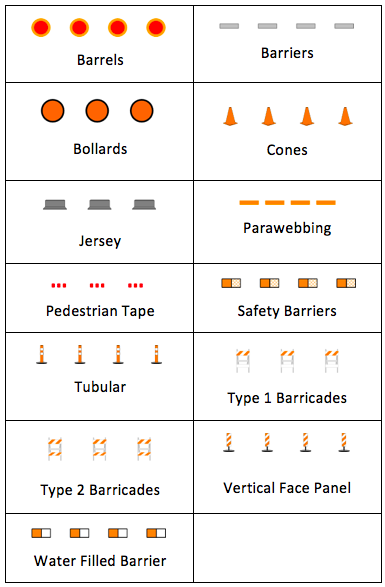
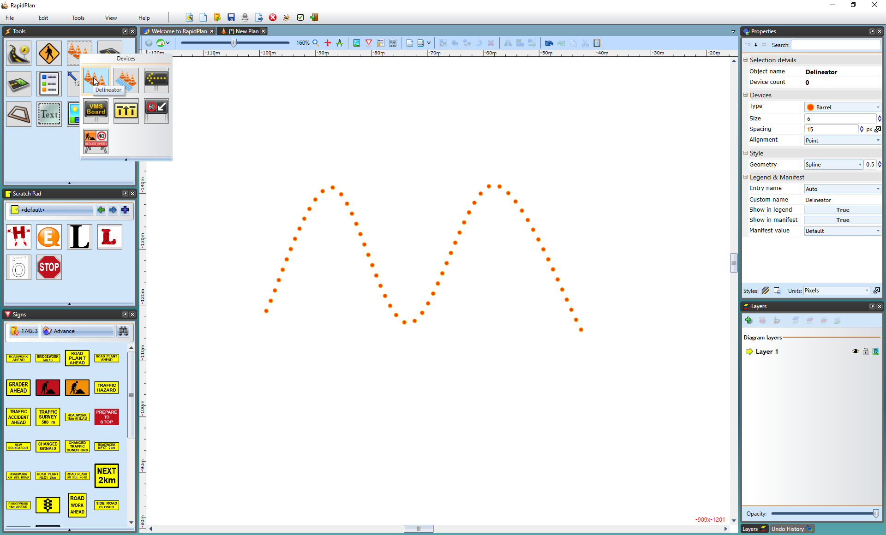
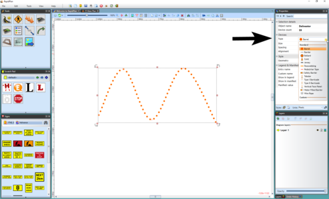
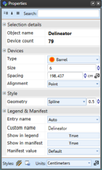
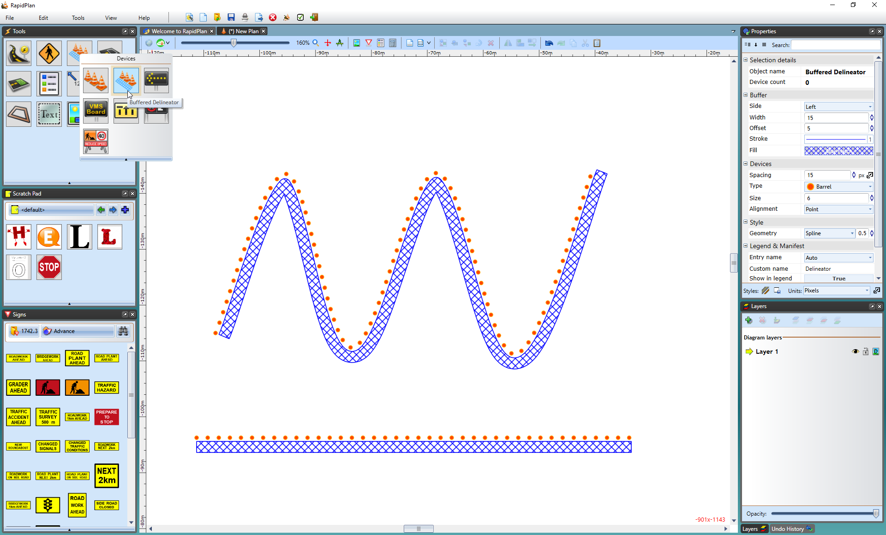

---

sidebar_position: 1
tags:
  - markers-devices

---
# Delineators

Traditionally, one of the most difficult things to do when creating a traffic plan was run out lines of bollards, cones, barrels, etc. The RapidPlan delineator tool allows you to drag out lines of devices in seconds.

**Types of delineators available:**

There are thirteen standard types of delineators available:

## Create a basic delineator line

All delineator lines start by default as Barrels with a size of 6 units and a spacing of 30 units. They can then be changed into the required type after placement on the plan. You can also set new default values from the **Properties palette**.

**To create a basic delineator line:**

1. Select the **Delineator** tool from the Devices tab in the **Tools palette**.
2. Click once where you want to start drawing.
3. Click at each corner of the line.
4. After you place the endpoint, right-click to stop drawing.
5. Right-click to clear the cursor.

    

## Change the delineator type

Once your line is on the plan, you can change the type of delineator that you use from the list on the previous page.

**To change delineator types:**

1. Select the delineator line on the plan and locate its settings in the **Properties palette**.
2. On the Devices tab, select the required delineator from the Type drop-down list.

    

## Change delineator properties

As always, more in depth editing is done via the **Properties palette**. The following properties can be edited for each delineator:

**Devices** - Type, Size, Spacing, Alignment

**Style** > **Geometry** - Line, Spline, Bezier

## Buffered delineator tool

The **Buffered Delineator** tool works much like the **Delineator** tool but adds a buffer zone. You can adjust its shape and change the delineator type.

