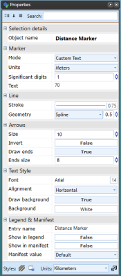
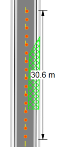
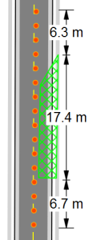
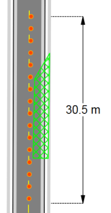
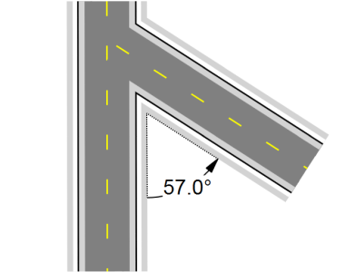
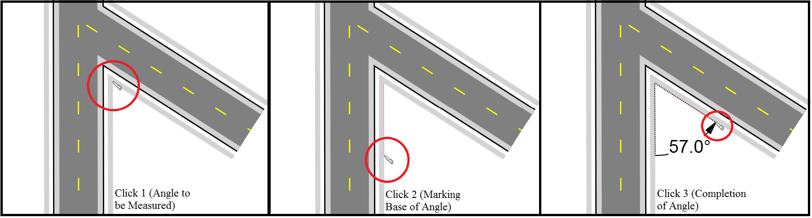
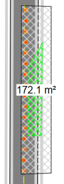
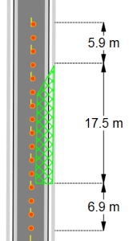
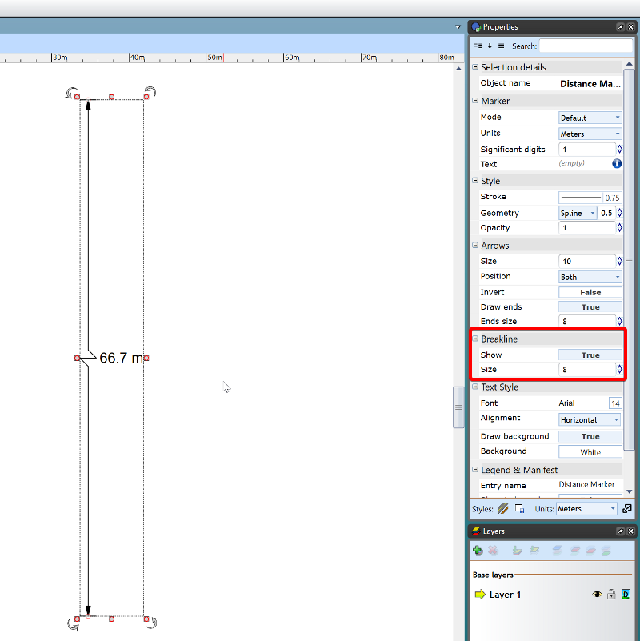
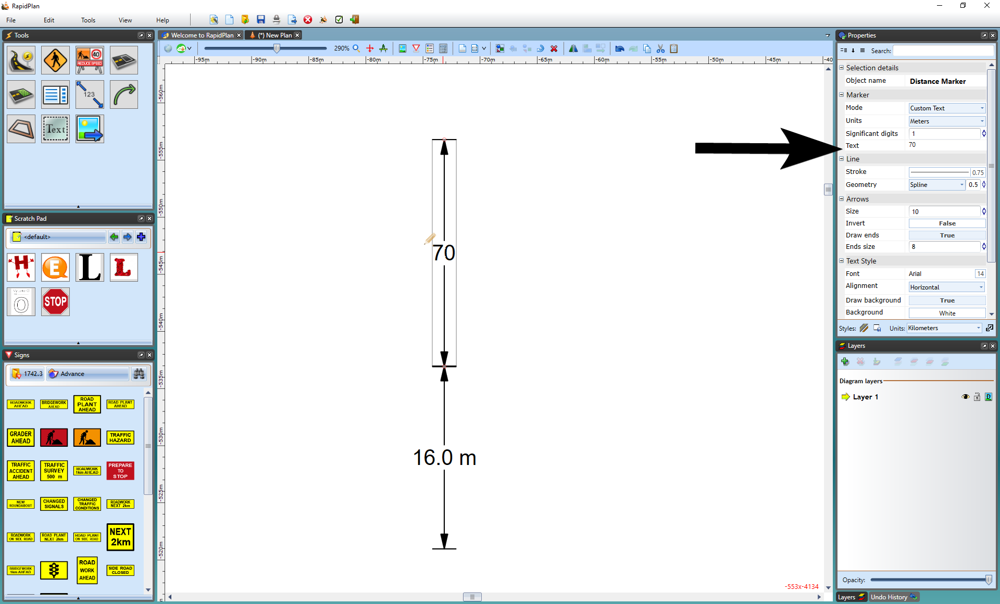

---

sidebar_position: 15
tags:
  - markers-devices
  - mapping-geospatial

---
# Distance markers

There are six marker tools for showing spatial information on a plan: **Distance Marker**, **Combined Distance Marker**, **Offset Distance Marker**, **Angle Marker**, **Area Marker**, and **Combined Offset Distance Marker**.

In essence, all six distance markers do exactly the same thing - they indicate to a reader the distance between elements. They all automatically calculate the distance and enter its amount. You can also enter your own values if needed.

## Create a distance marker

Irrespective of which **distance marker** you are using, the technique for creating it is much the same. However, there are some differences, so this will be explained separately for each marker below.

**To place a Distance Marker:**

1. Select the **Distance Marker** tool from the Marker tab in the **Tools palette**.
2. Click once to start drawing, then click again to mark the endpoint.
3. Right-click to finish.

**Note:** Hold **Shift** while drawing the distance marker to keep it straight.

## Change distance marker properties

For each of the distance markers, you can change the arrow size, stroke width and color, font color etc. Utilize the **Properties palette** to edit all settings for each marker.

## Six types of distance markers

### Distance Marker tool

The **Distance Marker** calculates one distance.

### Combined Distance Marker tool

This tool does the same as the **Distance Marker** but with the ability to show multiple distances as shown below.

**To place a Combined Distance Marker:**

1. Select the **Combined Distance Marker** tool from the Marker tab in the **Tools palette**.
2. Left-click once to start drawing, then left-click again to end the first distance and start the second.
3. Repeat until you have marked all required distances.
4. Right-click to finish.

### Offset Distance Marker tool

This tool allows you to un-clutter items on your plan by being "offset" from its true location.

**To place an Offset Distance Marker:**

1. Select the **Offset Distance Marker** tool from the Marker tab in the **Tools palette**.
2. Click once to start drawing, then click again to mark the endpoint.
3. Move the pointer laterally away from the distance marker to set the offset, then click to finish.

### Angle Marker tool

This tool enables you to show angle degrees on your plan.

**To place an Angle Marker:**

1. Select the **Angle Marker** tool from the Marker tab in the **Tools palette**.
2. Click the point from which you want to measure the angle.
3. Click again to mark the base point of the angle.
4. Move the pointer in the direction you want to measure, then click when the angle is at the required value and position.

    

    **Note:** Like any item in RapidPlan, the angle marker, once made, can be moved and adjusted, with the degrees changing accordingly.

### Area Marker tool

This tool calculates the area you allocate which is shown as the cross-hatched netting in the image below.

**To place an Area Marker:**

1. Select the **Area Marker** tool from the Marker tab in the **Tools palette**.
2. Left-click once to start drawing.
3. Continue clicking to set the corner points of the area.
4. Right-click to finish.

### Combined Offset Distance Marker tool

This tool allows you to create a combined marker that is offset on your plan.

**To place a Combined Offset Distance Marker:**

1. Select the **Combined Offset Distance Marker** tool from the Marker tab in the **Tools palette**.
2. Left-click once to start drawing, then left-click again to end the first distance and start the second.
3. Repeat until you have marked all required distances.
4. Right-click to finish the final distance.
5. Move the pointer laterally away from the distance marker to set the offset, then click to place it.
6. Right-click to finish.

### Distance Marker breakline

When not drawing to scale, use the Breakline property of a **Distance Marker** to indicate whether the marker symbolically represents a larger on-site distance.

To enable the breakline, simply select the **distance marker**, in its Properties there is a subheading for Breakline.

Simply change it from False to True and it will set the breakline in the middle of your marker. You can also adjust the size directly underneath.

## Change the displayed distance

1. Select the distance marker.
2. Double-click the displayed distance.
3. Enter the required distance.
4. Click anywhere on the plan to finish.

    
