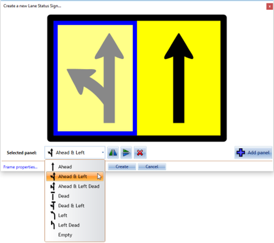

---

sidebar_position: 4
tags:
  - markers-devices

---
# Lane Status tool

This tool allows you to quickly and easily place lane status arrows or objects on you plan. A **Lane Status Wizard** box will open once this tool is selected where you can edit markers and add, flip, or remove lanes.

## Lane Status Wizard

Upon selecting the Lane Status tool, a wizard box will open where you can make all necessary changes to lane status situations. Within the wizard there are several status arrow options to choose from and multiple lane signs can be added as shown below.

## Create a lane status marker

- select the Lane Status tool from the Devices tab in the **Tools palette**
- edit these markers accordingly depending on lane closures and lane numbers needed within your plan
- remember you can Add and Delete panels, as well as adjust an arrow horizontally/vertically if need be
- move your mouse over the individual marker you'd like to change and make the desired changes
- click create to place the marker on your plan

    
